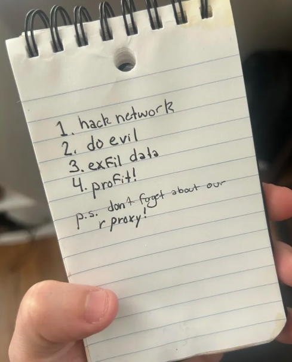
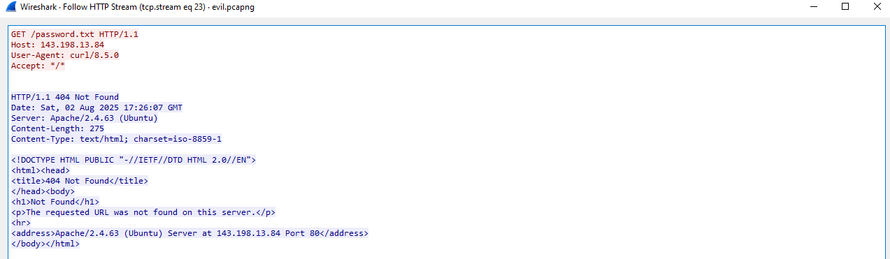
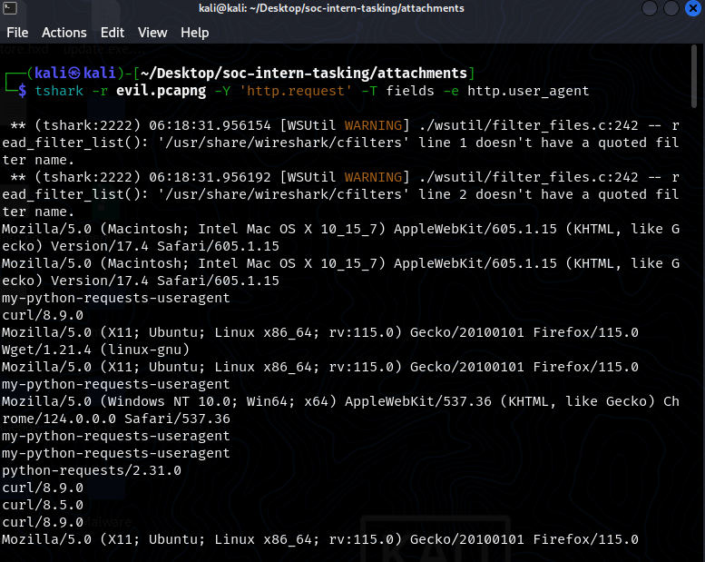
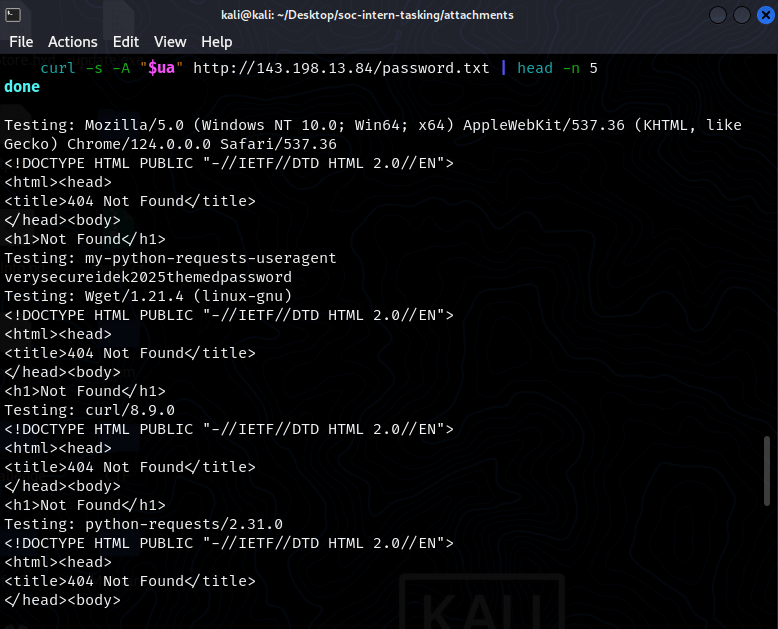
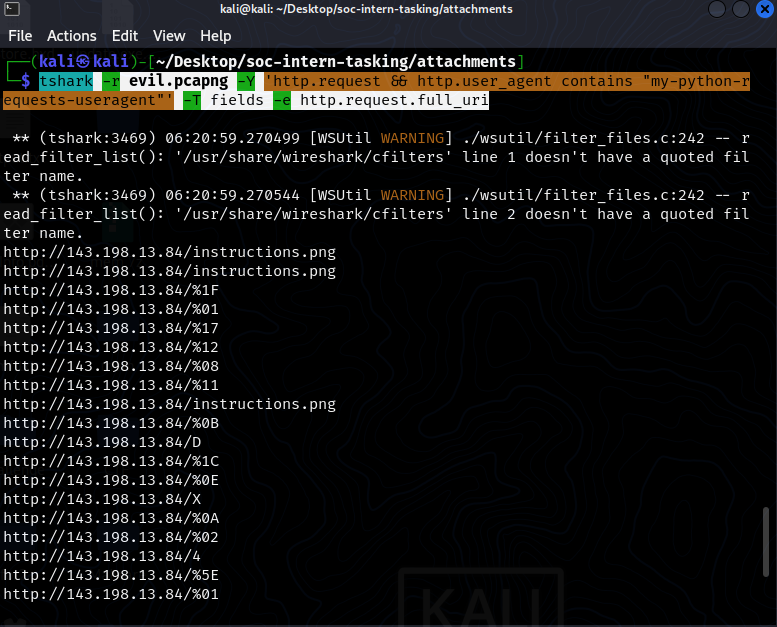

# _SOC intern tasking_

Challenge cung cấp cho mình một file `pcap` với 2 giao thức quen thuộc là `tcp`, `http`

Mình tiến hành `export` http về và nhận được 1 file `instruction.png`



Sau một khoảng thời gian trao đổi với `ChatGPT` và phân tích file `pcap` thì mình nhận thấy có khá nhiều `User-agent` khác nhau thực hiện `GET request`, kèm đó có 1 `file password.txt`



Thấy được `curl/8.5.0` `get request` nhưng bị `404 Not Found` nên mình sẽ tiến hành trích xuất hết các `User-Agent` thực hiện `request` và gửi `request` xem thằng nào sẽ trả về `200`

`tshark -r evil.pcapng -Y 'http.request' -T fields -e http.user_agent > agent.txt`



Tiến hành lọc trùng

```
"Mozilla/5.0 (Windows NT 10.0; Win64; x64) AppleWebKit/537.36 (KHTML, like Gecko) Chrome/124.0.0.0 Safari/537.36"
"my-python-requests-useragent"
"Wget/1.21.4 (linux-gnu)"
"curl/8.9.0"
"python-requests/2.31.0"
```

Viết đoạn script bash để thực hiện auto request đến `server`

```bash
for ua in "Mozilla/5.0 (Windows NT 10.0; Win64; x64) AppleWebKit/537.36 (KHTML, like Gecko) Chrome/124.0.0.0 Safari/537.36" \
          "my-python-requests-useragent" \
          "Wget/1.21.4 (linux-gnu)" \
          "curl/8.9.0" \
          "python-requests/2.31.0"
do
    echo "Testing: $ua"
    curl -s -A "$ua" http://143.198.13.84/password.txt | head -n 5
done
```
Thấy được tại `my-python-requests-useragent` thực hiện `Get` thành công `/password.txt`



Password: `verysecureidek2025themedpassword`

Tiếp theo, trong quá trình phân tích file `pcap` mình nhận thấy có rất nhiều `GET request` đến `enpoint` dạng `/X, /D, /%1F, /%0A, ...`

Mình tiến hành trích xuất hết các `request` đó với `agent` là `my-python-requests-useragent`

`tshark -r evil.pcapng -Y 'http.request && http.user_agent contains "my-python-requests-useragent"' -T fields -e http.request.full_uri`



Bước tiếp theo là decode từng GET param thành byte và `XOR` với `verysecureidek2025themedpassword`

```python
from urllib.parse import unquote

urls = """
http://143.198.13.84/%1F
http://143.198.13.84/%01
http://143.198.13.84/%17
http://143.198.13.84/%12
http://143.198.13.84/%08
http://143.198.13.84/%11
http://143.198.13.84/%0B
http://143.198.13.84/D
http://143.198.13.84/%1C
http://143.198.13.84/%0E
http://143.198.13.84/X
http://143.198.13.84/%0A
http://143.198.13.84/%02
http://143.198.13.84/4
http://143.198.13.84/%5E
http://143.198.13.84/%01
http://143.198.13.84/Y
http://143.198.13.84/%06
http://143.198.13.84/%2B
http://143.198.13.84/%09
http://143.198.13.84/%3A
http://143.198.13.84/%1F
http://143.198.13.84/V
http://143.198.13.84/%00
http://143.198.13.84/%2F
http://143.198.13.84/%15
http://143.198.13.84/%40
http://143.198.13.84/%12
http://143.198.13.84/%1A
http://143.198.13.84/%0A
http://143.198.13.84/%00
http://143.198.13.84/%19
"""

password = b"verysecureidek2025themedpassword"
lines = urls.strip().splitlines()
data_bytes = []

for line in lines:
    path = line.strip().split('/')[-1]
    decoded = unquote(path)
    data_bytes.append(ord(decoded))

xored = bytes([b ^ password[i] for i, b in enumerate(data_bytes)])

print(xored.decode(errors='replace'))
```
Chạy code liền lấy được `flag` : `idek{th1nk1ng_l1k3_a_r3d_t3amer}`


